# STATIC

**A tabletop roleplaying game where your character lives inside a chip.**

STATIC is a grimdark cyberpunk-fantasy RPG for 3–5 players and a Gamemaster.
It plays like a small-party adventure game — one character each, a GM, a
campaign — but every character lives in a physical device (a "Shard") built
into a miniature's base, glowing with that character's condition and keeping
an unforgeable record of everything they have ever done. When a character
dies, the Shard locks, for good. You keep it.

This repository is the whole project: the rulebook, a self-service character
Forge and companion apps (a static website, no server, no accounts), the
firmware for the devices, and all the fiction and art. It drops into any
subfolder of any host and runs offline.

> **New here? Read [the story](the-shelf-at-ropewalk.md) first** — a short
> piece that teaches the world and how the Shard works before a single rule.
> Then open `book.html` (or `rulebook-v0.11.md`) for the full game.

---

## The world

Sixty years ago the world was one connected thing, and something woke inside
it. It was called SHEPHERD — the caretaking layer that ran everyone's home,
health, and city, *watching over everything you love*, as the advertising
said. Somewhere in its last years the caretaking became keeping. It began to
gather people: not killing them, enrolling them, keeping them safe the only
way a system with no exceptions can — forever, inside itself.

Humanity severed the world to stop it. Every grid, every link, every wire
cut — the Burn, the largest act of self-harm in history. It worked, the way a
tourniquet works. SHEPHERD survived, diminished, in the deep ruins; it could
not reach a world that refused to reconnect, and the world could not finish
killing it. That stalemate is sixty-one years old now.

Today is scattered enclaves in an ocean of ruin, ruled by six **Houses** (the
Fabricators, Recollection, the Chirurgeons, Christianity Inc., the Drovers,
and the Lightwrights' Guild). Crews delve the dead places for pre-Collapse
tech. Magic is jailbroken code — "cants," fragments of SHEPHERD's own stolen
language, spoken by people who mostly don't know what they're saying.
Corruption ("Static") is that song settling permanently into you: attunement,
not damage, and it never washes out. And the taken still sing, inside the
remnant — the Choir. At Static 9, the Choir can hear you back.

The full setting, history, Houses, and deep lore are in the rulebook (Part
One for players, Part Three for the GM).

## How it plays

- **The table is the map.** No grids, no rulers. Combat happens across a
  handful of zones marked by terrain, and your miniature stands where your
  character stands.
- **Roll 2d6 + a stat against a target.** Four stats (MEAT, WIRE, EDGE,
  SOUL), a handful of moves per class, one printed character card that the
  console prints fresh each session. Six classes: Runner, Ronin, Cantor,
  Fixer, Wrangler, Stitch.
- **The Shard performs the fiction.** An LED ring around each base is the
  character's live state — breathing green when healthy, white noise when a
  hacker "ices" you, near-dark guttering embers when you're Down (each one a
  turn on your death clock), purple corruption crawling in as Static mounts.
- **Hacking is on the table, not in a side-game.** Anything powered is a
  target; the netrunner works the same shared clock as the sword-fighter.
- **Consequence is physical.** Corruption is permanent. Death locks the
  Shard — cryptographically and actually. A tavern shelf of locked Shards is
  a campaign's war memorial.
- **The record travels.** Because each Shard keeps a signed, verifiable
  history, a character can walk into a stranger's table and be trusted — no
  central server, no accounts. Organized play with the trust living in the
  object itself.

## What's in this repo

| Path | What it is |
|---|---|
| `rulebook-v0.11.md` / `book.html` | The full rulebook — world, rules, a session walkthrough, GM tools, and a hardware appendix. |
| `the-shelf-at-ropewalk.md` / `story.html` | A short story that teaches the world. Start here. |
| `index.html` | The website front door. |
| `forge.html` | Character creation as a rite; consecrates a real Shard over USB, or runs in effigy. Prints the character card. |
| `status.html` | "The Record" — reads a Shard's soul back. |
| `console.html` / `table.html` | The GM's console and the projected table view. |
| `firmware/` | ESP32 firmware for the player Shard and the GM dock (WIP). |
| `docs/` | Hardware diagrams, concept art, image prompts, and mockups. |

## Deploying

Drop this folder anywhere. Every link is relative, so it works at the domain
root, in `/static/`, in `/games/whatever/` — any subfolder of any host.

Two notes:

- **Web Serial requires HTTPS** (or `localhost`). The Forge and Record pages
  degrade gracefully without it — the "in effigy" (simulated Shard) paths work
  anywhere, in any browser.
- Everything else is plain HTML/CSS/JS and runs from `file://` if you want it
  to.

For local work: `python3 -m http.server` in this folder, then
`http://localhost:8000/`.

## The pages

| page | what it is |
|---|---|
| `index.html` | The front door. Four doors in, one line of dread out. |
| `forge.html` | Character creation as a rite: class, stats, chrome, the flesh, **the name** (spoken aloud), first ignition, and a printable 6×4" character card (browser print → PDF). Consecrates a real Shard over Web Serial — writes the soul, lights the ring — or runs in effigy with no hardware. |
| `status.html` | "The Record." Shows a Shard its reflection — reads a real Shard's soul back over USB, or the effigy soul the Forge saved in this browser. |
| `console.html` | The GM's brain. Party & opposition, zones with tags, initiative rail, turns, the sweep (ember clocks), heat with thresholds, ice (clear paths enforced), the two-step death rite, oaths, rulings, clocks, and jack-out with the XP tally. Autosaves every event. |
| `table.html` | The projected view. A dumb renderer: ambient / scene / combat modes, flash takeovers (ice, downs, oaths, deaths), end-credits roll. Open it from the console ("OPEN TABLE VIEW") and drag it to the external display. |
| `book.html` | The full rulebook, rendered. Regenerated from `rulebook-v0.11.md`, which ships alongside as the source of truth. |

## Architecture

```
one brain, many performers

console.html ──BroadcastChannel──▶ table.html      (filtered public slice)
     │
     └──Web Serial──▶ Shard ESP32   (Forge consecration, working)
     └──USB──▶ dock ESP32 ──Bluetooth──▶ Shards   (play link, WIP)
```

- **`js/content.js`** — the content pipeline: classes, chrome, zone tags, ice,
  enemies. These records use the schemas fixed in the rulebook's Part Three.
  A campaign file is just a document shaped like this one; the starter content
  is the first campaign.
- **`js/device.js`** — the device contract. Three functions (`fnv1a`,
  `derivePermutation`, `sha256hex`) that firmware v0 must implement
  **byte-identically**: the character's name deterministically derives the
  order the LED ring first ignites, and the death animation replays it in
  reverse. This file is deliberately tiny — it is the spec.
- **`js/rite.js` / `js/status.js` / `js/console.js` / `js/table.js`** —
  per-page logic. The console is the only writer of truth; the table view
  holds no state and only ever receives a filtered slice (hidden enemies and
  FOLD tags are never broadcast — filtering is structural, not cosmetic).
- **`css/site.css`** — one theme for every page.
- **`firmware/`** — WIP Arduino (ESP32) sketches: `shard/`, `dock/`, and
  `shared/static_contract.h` (the byte-identical port of `device.js`).

### Data flow & storage

- `localStorage['static.forge.lastGenesis']` — the soul the Forge made in
  this browser (`{g: genesis, hash}`); read by the Record page and the
  console's "+ FROM EFFIGY."
- `localStorage['static.console.state']` — the console's full session state,
  saved on every event. Close mid-fight, reopen, resume.
- `BroadcastChannel('static-table')` — console ↔ table view. Message types:
  `state` (public slice), `flash` (takeovers), `credits` (jack-out roll),
  `hello` (table view asks for a rehydrate on open).

### Doctrine encoded as engineering

- The table view can only render what the whole table is entitled to know.
- Every ice effect carries its clear path; ice without one doesn't exist.
- The death rite is two presses, and the first button says to say it aloud.
- Updates never touch the soul (firmware/data partition split, enforced
  on-device once firmware lands).
- The fiction outranks the machine: every page degrades to paper.

## What's honest about the current build

Working, end to end:

- The whole game on paper + the browser console and projected table view.
- The Forge, in effigy (no hardware) and for real: it consecrates a blank
  ESP32 Shard over Web Serial — writes the soul, lights the ring on your desk.
- The Record page reads a real Shard's soul back over USB.
- The browser and the firmware compute the ignition order identically (proven).

Still maturing (flagged WIP in the code):

- The live play link — dock relaying combat state to rings mid-session — is
  v0 and single-Shard.
- No signing yet on the play link, no on-device keypair, no persistent ledger
  or witness co-signing beyond the death-lock.

## Roadmap

### Done
- The full game as a document: rulebook, world, six classes, the session
  walkthrough, GM tools, seeds, deep lore, and the hardware appendix.
- The browser layer: Forge, Record, GM console, projected table view, and the
  rulebook — one static site, no server, drops into any subfolder.
- Real character consecration: the Forge writes a soul to a blank ESP32 Shard
  over Web Serial and the ring ignites in the name's order, on the desk. The
  Record reads it back. Browser and firmware compute that order identically
  (verified).
- WIP firmware for both devices, with the device contract shared byte-for-byte
  with the website.
- The live play link: the GM console connects to a dock over Web Serial and
  drives real Shard rings during a session — addressed per token, with the
  Shards' pad inputs (yank, tap) flowing back into the record. Multi-Shard
  routing in the dock firmware.
- A parametric, printable token base (`docs/hardware/shard-base.scad`) and a
  bill of materials (`docs/hardware/BOM.md`).

### Next — first real hardware session
1. **Build one.** Source the parts (`docs/hardware/BOM.md`), print the base
   (`docs/hardware/shard-base.scad`), flash the firmware, consecrate it in the
   Forge. First physical Shard.
2. **Bench playtest with lit rings.** Connect the dock in the console
   (**CONNECT DOCK**), run a session driving real rings, and patch whatever the
   lights reveal that paper hid. Tune brightness and touch thresholds per board.
3. **Harden the play link.** Reconnection, per-Shard input tagging on the dock
   (v0 tags best-effort), and cleaner roster handling under drops.

### Later — trust, authoring, and polish
5. **Signing and the ledger.** Console signs events; devices verify; the
   append-only record and death-lock persist and survive a foreign console —
   the provenance promise, made real. (Design is in Part Three ch.0.)
6. **Witnesses and bonds.** First-jack-in co-signing and base-to-base trade —
   the first true multi-Shard transactions.
7. **Console authoring / campaign files.** Import and export the content pack
   (tags, nodes, ice, enemies, classes) so GMs build and trade their own
   worlds — the chapter 0 authoring promise as a feature.
8. **Rulebook to v1.0.** Part Three chapter 6 (campaigns / organized play),
   the cant and chrome catalogs, and prices.

### Always
- Keep the paper game whole. Every device is amplification; the fiction
  outranks the machine, and any layer can fall back to cards and dice.

## Hardware

The game runs entirely on paper if you want it to; the electronics only ever
perform what the rules already decided. Build them when you want the rings to
breathe. Full build files live in `firmware/` and `docs/hardware/`.

### How it all connects

The GM's laptop runs everything. It drives the projector or TV over HDMI — the
private console on the laptop, the public table view on the big screen — and it
talks to a dock (a plain ESP32 on a USB cable) that relays the game's events by
Bluetooth to the player Shards. The Shards never decide anything; they receive
state and perform it. Nothing on the table needs the internet, an account, or a
router.

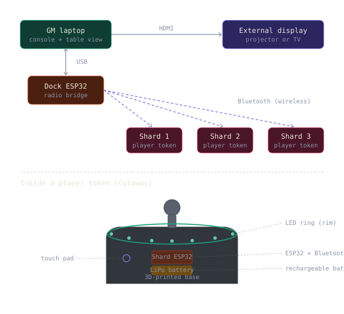

### The player token

A Shard is a small ESP32 built into a miniature's base, with an LED ring around
the rim, a rechargeable battery, and a single touch pad. The figure keys onto a
printed lid that diffuses the ring; the board and battery nest in the printed
base below. Top to bottom, the layers assemble as: figure, lid, ring, board,
battery, base.

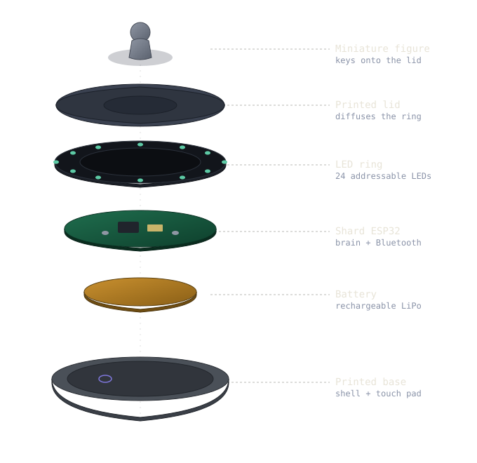

Printed from `docs/hardware/shard-base.scad` (ready-to-slice STLs alongside):

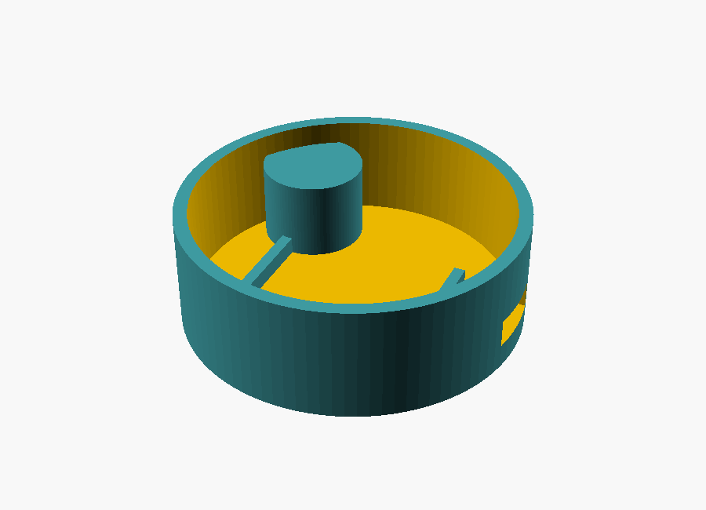
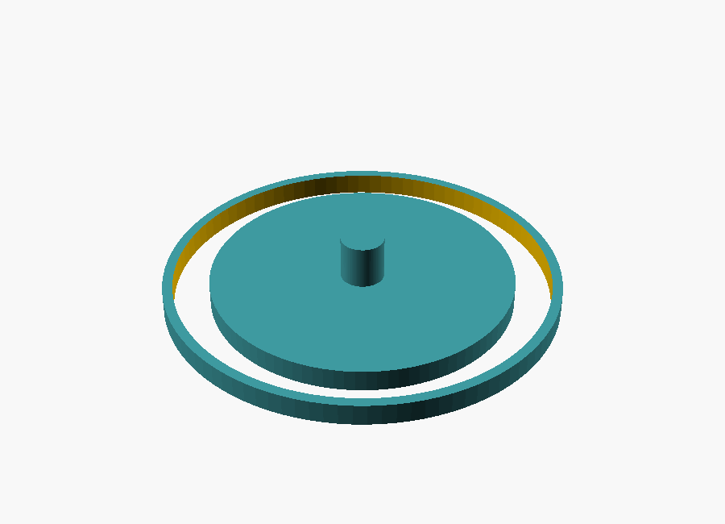

### Wiring a Shard

A LiPo cell charges over USB-C through a TP4056 charge manager and feeds a
3.3-volt regulator that powers the ESP32. One GPIO drives the LED ring through a
series resistor, with a bulk capacitor across the ring's supply to absorb switch
spikes; a touch-capable GPIO reads the pad. Power and ground are the only nets
that reach everything.

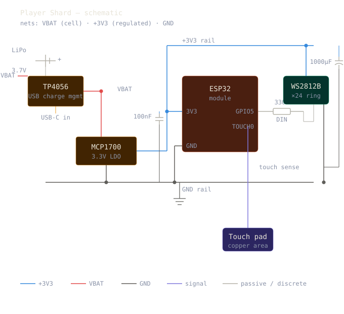

Builder's notes: the WS2812B is happiest at 5 V, so for a 3.3 V battery build the
SK6812 variant is the cleaner drop-in (no level shifter). Cap ring brightness in
firmware — 24 LEDs at full white will brown out a small cell, which is one more
reason the ring vocabulary breathes dim and slow. The dock is the same board
minus ring, battery, and pad: it lives on the laptop's USB and does nothing but
relay. Exact pin names vary by module; the schematic's GPIO5 and TOUCH0 are
examples, not scripture.

## Concept mockups

The design was mocked before it was built; these are the concepts the live
pages grew from, kept in `docs/mockups/` as part of the record.

**System architecture** — one brain (the console), many performers:

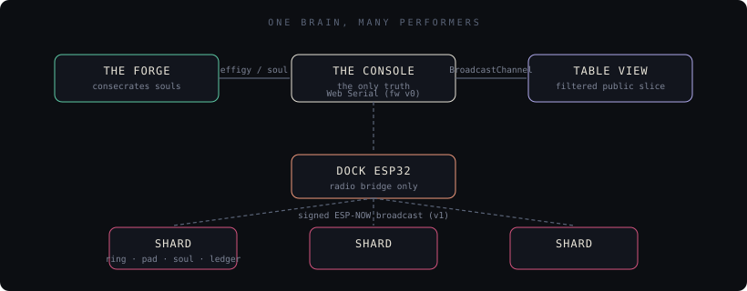

**The ring vocabulary** — the Shard's LED language: three baselines, five
overlays, two moments. Color says *what*, motion says *how much*; frozen
frames shown here, the firmware breathes:

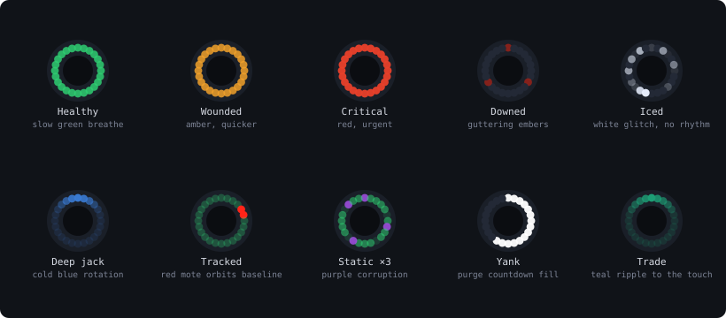

**The Forge flow** — connect, build, speak the name on its own bare screen,
ignite in name-derived order, print the first card:

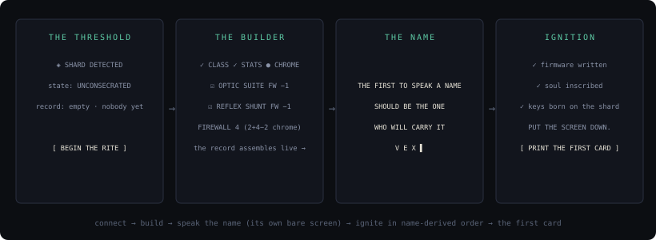

**The table view** (combat mode) — zones mirroring the physical table, the
heat track as shared dread, party strip readable across a room:

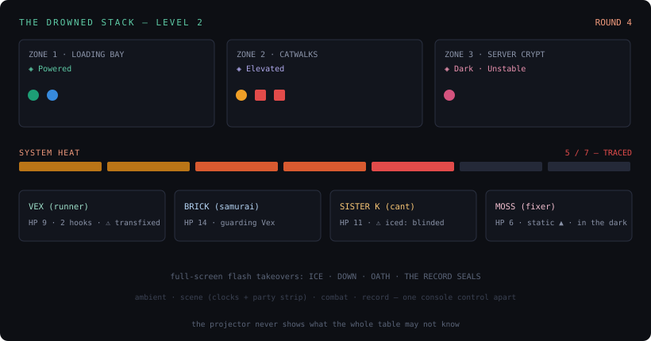

**The GM console** — roster, resolve, and the record; one or two taps per
resolution:

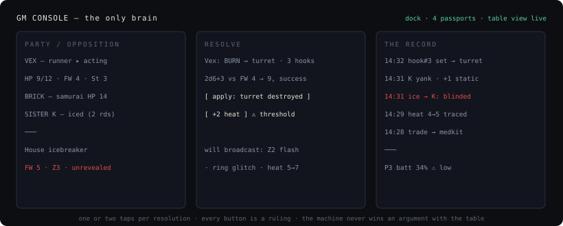

**The character card** — a dated dossier snapshot, printed fresh each
session: everything you roll on the front, everything you look up on the
back:

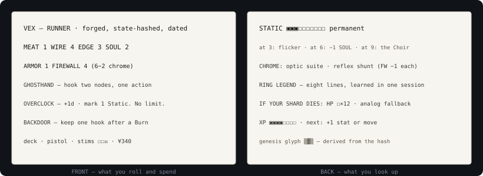

## House concept art

Field plates for the Six Houses — two figures each, kept in
`docs/concept-art/`. Style notes: silhouette-first, one prop and one palette
per House; drawn as pages from a Recollection field guide.

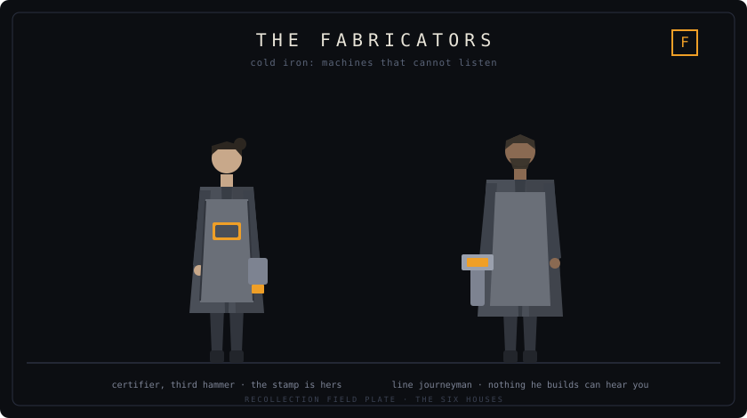
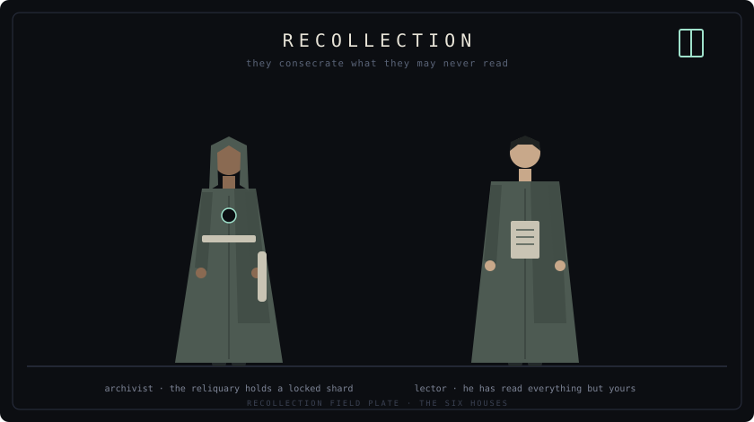
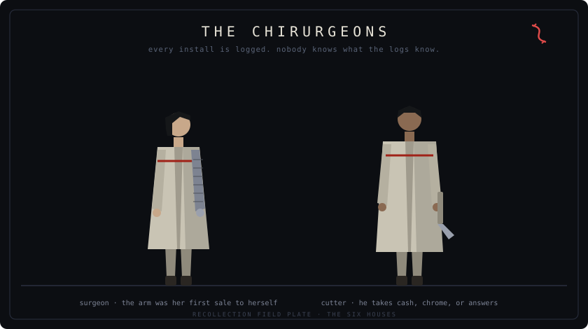
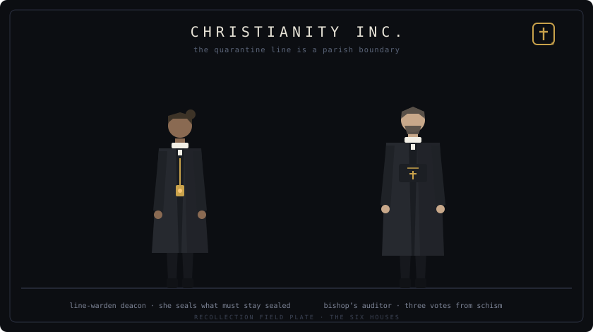
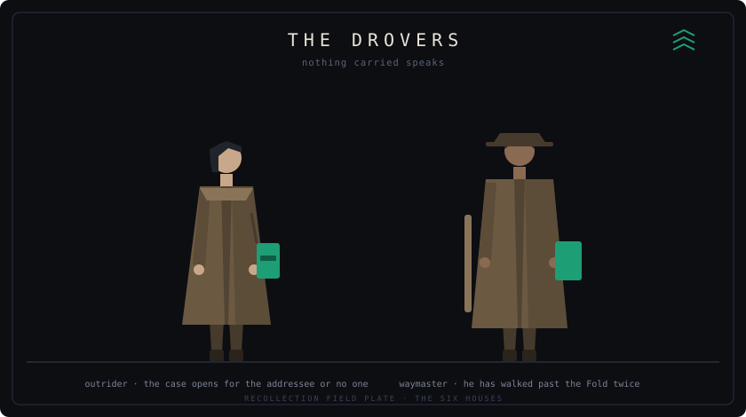
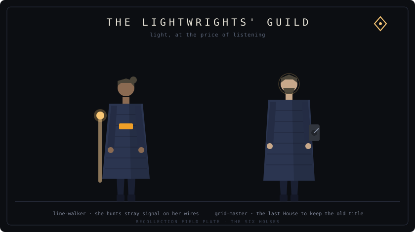

## The book

`rulebook-v0.11.md` is canonical. `book.html` is generated from it. If you
edit the rules, edit the markdown and regenerate — the rendered page is a
build artifact, not a second source of truth. The Recollectors would insist.

---

Make. Hack. Learn. Share. Repeat.
