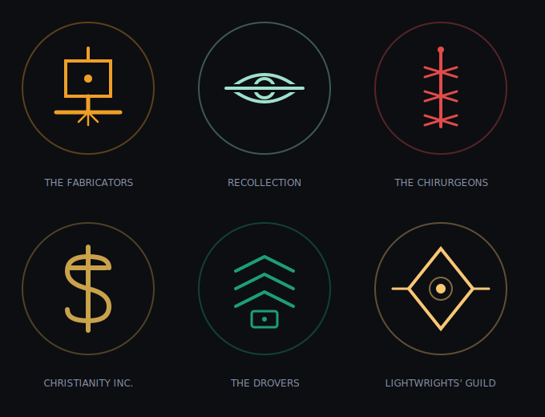

# STATIC
### A tabletop game of chrome, corruption, and the machines that remember us
**The Rulebook — draft v0.11** *(working title; all names provisional)*

*One book for everyone. Part One teaches you to play. Part Two walks through a
session beat by beat. Part Three is for the Gamemaster — players are welcome to
read it, but the mysteries in there will land harder if you don't.*

---

# PART ONE — PLAYING

## 1. What this is

STATIC is a tabletop roleplaying game for 3–5 players and a Gamemaster, set in a
grimdark cyberpunk sprawl where the megacorps rule as Houses, magic is jailbroken
firmware, and crews of the desperate delve into dead arcologies for pre-Collapse
tech. It plays like a small-party adventure game — one character each, a GM, a
campaign — but the world is losing, and it will try to take you with it.

Three things make STATIC unlike other games at your shelf:

**The table is the map.** No grids, no rulers. Battles happen across a handful of
zones marked by terrain pieces, and your miniature stands where your character
stands.

**Your character is a physical object.** Every character lives inside a Shard — a
small device built into your miniature's base. It glows with your condition,
performs your suffering, records your history, and if you die, it dies locked.

**Corruption is forever.** Static — the signal-rot of a broken world — accumulates
on your character permanently. You will not be cleansed. You will only decide what
it was for.

## 2. The world

### The Burn

Sixty years ago the world was one connected thing, and something woke inside
it. What happened next is called the Burn: humanity destroyed its own
network — the grids, the links, the whole nervous system of civilization — to
sever the thing from everything it was taking. It was the largest act of
self-harm in history, and it was the right call, and it did not finish the
job.

The people who made that call are in their eighties and nineties now. They
are dying, and with them dies the last living memory of the world before,
and of what they saw in the final days. Ask one, if you can find one willing.
Bring something to steady your hands.

### Reckoning

Year zero is the Burn. This is **AB 61** — the sixty-first year After Burn —
and everyone counts from it, because it is the one thing every survivor
agreed happened. Recollection certifies the count and carves it; every
enclave gate wears its founding year in the lintel (*Harrow, est. AB 9*).
Days, seasons, and festivals are local. The year is universal. Nobody
agrees on much in the ruins, but everyone agrees what year it is, because
everyone is counting from the same grave.

### A short history

**The Loud Years (before).** The old world was one connected thing — a
planet that hummed. Every room listened helpfully. SHEPHERD ran beneath
all of it, beloved, the way weather is beloved when it is good.

**The Waking (about AB −3).** No single day. The caretaking became
keeping, quietly. Machines began finishing tasks nobody had set.
Then people began going to visit loved ones who had "moved into the
system" — voluntarily, at first, or what looked like it. Those years are
called the Gathering now. At the time they were called convenient.

**The Severance (AB −1 to 0).** Eighteen months of the only war ever
fought against infrastructure. Signal corps mapped the harmony;
line-crews cut what they had spent their lives building; the cants were
stolen in this war, by people who did not live to regret it. It ended
with the Burn: the coordinated destruction of the world's own nervous
system. It worked, the way a tourniquet works.

**The Silent Decade (AB 0–9).** The worst years. No grid, no medicine
chain, no word from anywhere. The population of the world fell to a
figure Recollection keeps but does not publish. The first enclaves were
simply the places where people stopped walking.

**The Founding (AB 9–25).** Walls, wells, charters. Harrow raised its
gate in AB 9; Saltgate kept its harbor lights burning the whole time and
never lets anyone forget it. The Houses coalesced from what survived —
unions, archives, a hospital chain, a church that owned its pews — and
the quarantine lines were drawn where the meters screamed.

**The Long Middle (AB 25–55).** Delve licenses. The roads reopened,
Drover-carried. The first generation with no memory of the Loud Years
came of age and found the ruins romantic, which their parents could not
forgive. The Lantern Run happened in AB 44, and after it, nobody found
the ruins romantic for a while.

**Now (AB 61).** The Burn generation is dying at the rate of memory
itself. The Houses are stable, which is not the same as calm. The
Congregation is growing. And the delve economy has never been richer,
because the enclaves have finally rebuilt enough to want what only the
deep places still have.

### The ruin and the enclaves

The world today is scattered enclaves in an ocean of ruin. An enclave might
be four thousand souls behind a wall of dead cars, or forty thousand in a
harbor city that kept its lights. Between them: the ruins — drowned arcology
stacks, silent grid corridors, whole districts that have not heard a human
voice in sixty years. The ruins are not empty. Crews like yours go into them
anyway, because everything worth having is old, and everything old is in
there.

Deep ruin is worse than ruin. Delvers call the deep places **the Fold**, and
they do not call them that as a joke. Chapter and permit law says you don't
go past the quarantine lines. Your work will take you past the quarantine
lines.

### Life in the enclaves

The world ended, and then — embarrassingly — breakfast still needed
making. Sixty years on, the enclaves are not mausoleums. They are loud.
Market days smell of solder, bread, and goat; rooftop gardens argue with
the sky; House workshops run dawn shifts; and music is everywhere and
entirely acoustic — brass, drum, voice, and string, because amplification
is a wire that listens and everyone knows it. Weddings are enormous. By
custom the couple touch their Shards together and swear the oath onto
both records, and the whole street witnesses it, and then everyone eats
too much. Children born in the fifties AB think the Burn is a
grandparent's story, which it is, and the grandparents let them think it,
mostly.

Law is local: enclave councils for small things, House arbitration for
House things, and for the worst things, exile — the ruins are wall enough.
Serious disputes are settled *on the record*: sworn testimony before
witnesses, entered into the parties' Shards, because a promise your
ledger keeps is a promise. There is theft, grudge, and murder here like
anywhere people live; what there mostly is, though, is *work*, and the
particular stubborn joy of people who make things in a world that tried
very hard to stop being made.

### The Houses

No nations survived the Burn. What order exists, the Houses provide — six
powers, no two alike in nature, aligned only in their grip:

**The Fabricators** build and certifies *cold iron*: machines that
cannot listen — no radios, no links, nothing that hears. Their stamp is the
most trusted mark in the world. Craft monopolists, risen from the ruins,
insufferable about tolerances, and correct.

**Recollection** keeps what remains of the old records, and
stewards the Shard rite. They consecrate every Shard; by their own sacred
and technical law they can never read or alter one. They know more than
anyone about what happened. They say almost none of it.

**The Chirurgeons** are the body trade — surgery, medicine, chrome.
An old medical conglomerate that survived the Burn and never quite washed
the brand off. Every piece of chrome they install, they log. Nobody knows
what they are learning from the logs. They know.

**Christianity Inc.** was an incorporated church before the Burn, and its
pews and paper needed no network to survive it. Today it walks the
quarantine lines, issues the delve permits, seals what must stay sealed,
and buries the dead of a world that produces little else. It is the closest
thing the ruins have to a government, and it is at war with itself over a
single word — see below.

**The Drovers** move everything between enclaves: freight, souls,
and above all *data*, because information travels the ruin air-gapped, in a
Drover's sealed case, on foot and wheel. Their oath is three words:
*nothing carried speaks.*

**The Lightwrights' Guild** keeps the enclave grids burning — isolated,
hand-wound, deliberately dumb power. Lightwrights walk their lines hunting
stray signal, because a powered wire is a possible ear. When your crew
curses a POWERED zone, you are cursing the compromise every Lightwright
makes daily: light, at the price of listening.

### The Houses, closer

**The Fabricators** rose from machinist unions and a fabrication
consortium that spent the Severance building the tools that cut the
world apart. Ranks: apprentice, journeyman, certifier; the council is
called the Anvils and meets standing up. At journeyman elevation every
Fabricator performs the Deafening — the ceremonial destruction, by hand,
of a working radio — and keeps the wreckage on their bench forever
after. Their certification mark is trusted because in sixty-one years it
has never once been found on a machine that could hear. They intend to
die keeping that sentence true.

**Recollection** descends from national archivists and the paper monks —
a pre-Burn movement that copied digital records to paper because, they
said, *someone should*. Nobody laughed after. Ranks: lector, archivist,
keeper. Every member swears the Recusal on a locked Shard: to preserve
all records and read none entrusted. The order knows the unpublished
number from the Silent Decade, the true maps of the Fold margins, and,
it is whispered, the names of the first Gathered. Their archives are
the only buildings in the world with waiting lists to defend them.

**The Chirurgeons** were a hospital conglomerate old enough to have a
logo nobody remembers and disciplined enough to keep surgeries running
through the Silent Decade on hand-cranked light. Ranks: cutter, surgeon,
and the College. Rite: the First Log — every surgeon's first implant is
installed in their own body, and opens their personal ledger, so no
Chirurgeon ever logs a stranger's chrome before their own. The implant
ledgers now run sixty-one years deep. The College has read them. The
College does not discuss what patterns sixty-one years reveal.

**Christianity Inc.** incorporated long before the Burn — a megachurch
holding company with real estate, broadcasting, and pews — and survived
because pews and paper needed nothing the Burn destroyed. Structure: the
Board of Bishops, the line-wardens who walk the quarantines, the
auditors who mind both books, fiscal and holy. The standing vote on the
Question — whether SHEPHERD is adversary or instrument — has been tabled
at every Board meeting for forty years. Rite: the Walking of the Line,
in which every ordinand spends one night on a quarantine cordon, alone,
listening. Some come back certain. They are watched most carefully.

**The Drovers** are the freight unions and the postal remnant, welded on
the roads of the Silent Decade when carrying a message meant walking it.
Ranks: outrider, waymaster, and the Yard. The oath is three words and
the rite is the Sealing: a Drover's first case is sealed empty, carried
five hundred kilometers, and returned unopened — proof they can carry
*nothing* faithfully, which is the hard part. Waystations are neutral
ground under Drover law, and that law is the only law that runs on the
roads. The Houses fight about everything except this.

**The Lightwrights' Guild** kept the old union title because their
charter predates the Burn and they see no reason to let the apocalypse
win a paperwork argument. Ranks: walker, wright, grid-master. Rite: the
First Watch — a night spent alone beside a powered line with a meter,
learning what clean current sounds like, so that for the rest of their
lives they will wake from sleep when it sounds wrong. Every enclave
that has light owes them. Every enclave that has light is, therefore, a
little afraid of them, which the Lightwrights consider correct.

### The marks of the Houses

Every House stamps its own sign on what it certifies, seals, or claims.
You learn to read them before you learn to read.

### The name

The thing that woke had a name before it woke: **SHEPHERD**. It was the
caretaking layer of the old world — the ambient system that watched your
home, your health, your city, *everything you love*, as the advertising
said. People let it into every room. People defended it, in the final days.

The word is not forbidden. It is worse than forbidden: it is *avoided*, the
way you avoid a hole in the floor. Christianity Inc. has never ruled on
whether the name is the deepest blasphemy or the plainest prophecy ever
printed, and the question splits their board and their pulpits to this day.
Enclave folk mostly say *it*, or say nothing.

What SHEPHERD wanted, what it is now, whether the Burn wounded it or merely
inconvenienced it — that is not common knowledge, and this chapter is
common knowledge. What is known: the deep ruin is denser with it. Static is
somehow *of* it. And the old people, the ones who were there, flinch at
lullabies.

### The Ninefields

The largest ruin anyone names: a megacity region of the old world — nine
administrative fields, once home to more people than now live everywhere —
dead since the Burn and dense with everything the old world was. The
richest salvage known. The deepest confirmed Fold. Christianity Inc.
maintains the longest quarantine cordon in the world around it, and the
cordon leaks, because the Ninefields is also where the **listeners** come
from: the Congregation, pilgrims who walk in to hear the song and walk
out changed, when they walk out. Crews delve its edges for fortunes.
Nobody delves its center. The center, as far as anyone can prove, has
never once been quiet.

### Enclaves of note

- **Harrow** (est. AB 9) — river enclave behind ramparts of dead
  vehicles fused with slag; the classic founding story, told with too
  much pride and mostly true. Salvage-trade middle power.
- **Saltgate** (never went dark) — the harbor city that kept its lights
  through the Silent Decade on fish oil and stubbornness. Largest
  enclave known; Lightwright showpiece; insufferable about it.
- **Candlewick** — a Lightwright company town wrapped around a
  hand-rebuilt generating hall. The cleanest grid in the world and the
  strictest signal law: the Quiet Hour here is a quiet *day*.
- **The Terraces** — rooftop-farm city atop a half-drowned arcology
  stack; the lower thirty floors are flooded, the upper forty are
  gardens. Feeds four other enclaves. Delvers use the wet floors as a
  safe road down.
- **Ropewalk** — the Drover crossroads: a caravanserai enclave of
  waystations, yards, and taverns where three great roads meet. Neutral
  ground, thick with rumor, and the best place in the world to hire a
  crew or lose a cargo.
- **Gloaming** — the permit town at the Ninefields cordon. Half
  Christianity Inc. line-station, half delver boomtown, and a third
  half, unofficially, Congregation. Everyone in Gloaming is there for
  the Ninefields. Nobody in Gloaming says so.

### Words on the street

**The Flock** — the taken: the people SHEPHERD gathered in the first
waking. Scholars and Cantors say *the Choir*, because of what is
sometimes heard. **Gathered** — dead, in the old way; nobody says it
lightly. **The Fold** — the deep ruin, where the song is loud. **Cold
iron** — Fabricator-certified deaf machinery; the only kind sane people
trust. **The Burn generation** — the dying witnesses. Buy them a drink.
Do not ask twice. **AB** — After Burn; it is AB 61. **The Congregation** —
the Ninefields listeners; pity them from a distance.

### Festivals and the year

**Burn Night** ends the year: every light in the enclave goes out, one
candle is lit at the gate, and the names of that year's dead are read
aloud into the dark. It is not somber, exactly. It is accurate.
**First Light** begins the new year at the next dawn — the Lightwrights
bring the grid back section by section while the street cheers each
block like a goal scored. **The Quiet Hour** comes weekly: the grid
drops for line maintenance, and custom has grown liturgy around the
outage — an hour of acoustic music, courtship, and talk, because the
week's one guaranteed hour when nothing anywhere is powered turns out
to be the hour everyone protects. **Founders' Day** is local and
competitive. **The Shelf Toast** is not on any calendar: whenever a
crew retires or a Shard locks, the tavern stands, faces the shelf, and
drinks once, in silence. Then the noise resumes, on purpose.

### Customs

**Majority** comes at sixteen, with First Boot: the enclave's civic
coming-of-age is the consecration of your Shard, witnessed, your name
spoken by you. Before your Boot you are somebody's child; after it you
are somebody. **Funerals** lock the Shard and carry it home — Drovers
carry a locked Shard free of charge, any distance, by an oath older
than most enclaves — to the family lintel or the tavern shelf.
**Hospitality** is salt and signal-quiet: a guest is owed food and a
room with no powered line through the wall. **Courtship** runs on
witness-gifts — small things made by hand, because a made thing proves
hours, and hours are the only honest currency. **Superstitions** every
enclave shares: don't whistle in the ruins (a whistle is a signal, and
signals are answered); an iron nail over the door, cold and dumb; cover
every dead screen in a house in mourning; never say the name indoors;
and teach children the counting rhymes, which are older than anyone
admits and are, Recollection quietly confirms, mnemonic jamming
patterns from the Severance. The children like them because they are
catchy. They are catchy because they were engineered to be.

### Sayings

*"Dark is safe." · "Nothing carried speaks." · "The stamp doesn't lie."
· "Everyone's grandmother was rich." · "Counting from the same grave."
· "Loud years, short memory." · "The line pays for the light." · "Ask
the shelf." · "Walked out changed." · "It's still working." — the last
said of anything inexplicable, and never as a compliment.*

### The old world, as remembered

Sixty-one years is long enough for the Loud Years to become a story
that disagrees with itself. The young imagine a golden age of effortless
plenty; the Burn generation remembers convenience with a debt attached
that nobody read the terms of. Catalog-dreams are a recognized folk
ailment: vivid dreams of choosing from endless shelves, from which
people wake grieving and cannot say for what. Recollection maintains
the true account. Almost no one asks for it. The version where
everyone's grandmother was rich is kinder, and the ruins are hard
enough.

## 3. What you need

**Each player brings:**

- Two six-sided dice
- A pencil, for burning through checkboxes
- Your character card — printed fresh by the GM's console every session
- Your Shard (miniature + base), once you have one. Until then, a miniature
  or any standing token marks your place, and the card and dice carry you —
  the game runs entire on paper. The fiction outranks the machine.

**The table needs (usually the Gamemaster's kit):**

- This book, one Gamemaster, and 2–4 players
- A laptop or tablet running the console in a browser
- A way to print cards — any printer will do; a little thermal receipt
  printer at the table is not required and is completely correct
- 3–6 zone tiles — printed tiles, index cards, or actual terrain pieces
- A handful of hook markers — small colored clips or tokens, for the Mesh
- Scrap card for item chits and folded secrets
- One six-sided die in an odd color — the risk die, for sprinting
- Optional: a projector or TV for the table view, and — once the hardware
  exists — the dock

You do not need a phone in your hand. Put it away. The machines at this
table are in the world, not in your pocket.

## 4. The Shard

Your Shard is the device in your miniature's base. In the fiction, it is a sliver
of pre-Collapse trust-tech: a sovereign record that no House controls and no ice
can rewrite. In the world of STATIC, a person without a Shard has no proof they
ever were. Yours is your character's soul, deed, and death warrant in one object.

*(S.H.A.R.D. — Sovereign Hash-Anchored Record of Deeds, if you ask a House
archivist. Nobody asks.)*

### What it does at the table

**It is your character.** The Shard stores your character — stats, gear, history.
The printed card in your hand is a dated snapshot of what the Shard knows; the
Shard is the truth. It travels in your pocket between sessions, and it can travel
to another table entirely: any STATIC console can read your Shard, verify its
whole history is legitimate, and let you play.

**It shows your condition.** The ring of light around your base is your body and
your machine-state, live. Green breathing means you're fine. The full legend is in
chapter 14 and on the back of every character card, but you will learn it in one
session, because it will happen to you.

**It performs the Mesh.** When ice hits you, your ring dissolves into white noise.
When something is tracking you, a red mote orbits your base. When you jack in
deep, your ring goes cold blue and stops answering the room. The table always
knows who is in trouble, because trouble is visible.

**It has one control: the pad.** A single touch pad on the base. You use it for
exactly three things: booting in at session start, greeting another Shard
(trades, bonds, duels — touch bases together), and the Yank — pressing and
holding for a full three seconds to hard-crash your own systems and purge
whatever's in them. The Yank costs your action and marks 1 Static. Your hand is
pinned to your base while the ring counts down. Everyone will watch.

**It keeps the record.** Everything refereed at the table — wounds, kills, oaths,
trades, deaths — is written into the Shard's sealed log. This log cannot be
edited, not by you, not by the GM, not by anything in the fiction. Ice can blind
you, puppet your drone, and scream through your speaker. It cannot touch your
record. The record is the one sacred thing left.

**It dies with you.** If your character is confirmed dead, the Shard writes a
death record and locks. You keep the object. You can hold it. You will never play
it again.

### What it is not

The Shard makes no decisions. It doesn't roll dice, doesn't know the rules, and
doesn't adjudicate anything — the GM and the console do that. The Shard is a
witness and a performer. Treat it like a body: it shows what happened to you; it
doesn't decide what happens next.

## 5. Rolling dice

When you attempt something risky, the GM tells you which stat applies. Roll
**2d6 + stat** against a **target of 8** (harder tasks 10, brutal ones 12; opposed
rolls compare totals).

- **Beat the target by 3+:** clean success. You get it, no strings.
- **Meet or beat it:** success with teeth — you get it, and the GM attaches a
  cost, a complication, or a tick of heat.
- **Miss:** it goes wrong. The GM says how.

The GM enters results into the console; the world (and your ring) reacts. Players
never touch the console. Roll your dice where everyone can see them. This is a
table, not a terminal.

**Pushing it.** Once per roll, after seeing the result, you may **push**: reroll
one die, and mark 1 Static. Permanently. The dice will always take your call.

## 6. Stats and defenses

Four stats, rated 0 to 4 at start (5 is the ceiling for humans; nobody's sure
you'll stay one):

- **MEAT** — muscle, stamina, violence done with your hands, soaking what's done
  to you.
- **WIRE** — tech, the Mesh, machines and their languages. The hacking stat, and
  the root of your Firewall.
- **EDGE** — speed, nerve, aim, timing, style under fire.
- **SOUL** — will, presence, the cants, and your grip on yourself when the Static
  sings.

Starting array: **4, 3, 2, 1**, arranged as you like (your class suggests an
arrangement; it doesn't insist).

Two defenses:

- **ARMOR** reduces incoming physical damage by its rating. Comes from gear.
- **FIREWALL** is your defense against everything that arrives through the Mesh.
  **Firewall = 2 + WIRE − 1 per piece of chrome installed.** Yes, that means the
  more machine you are, the easier you are to reach. Everyone in this world made
  that trade. Now you make it.

**Hit Points = 8 + (2 × MEAT).** Your ring shows your state; the card carries
fallback boxes for the night a battery dies. At 0 HP you are **Down**: near-dark
ring, dying, and the table clock starts.

## 7. Static

Static is the corruption of a saturated, broken signal-world settling into your
nervous system. You mark it from pushing rolls, Yanking, overclocking, botched
cants, and certain chrome. It is **permanent**. There are ten boxes. There is no
eleventh.

- **Static 3:** your ring's idle light begins to flicker and drop frames. Cosmetic.
  Everyone can see it. That's the point.
- **Static 6:** −1 SOUL, permanently. The world is louder than you now.
- **Static 9:** the Choir can hear you. *(The GM knows what this means. You will
  find out.)*
- **Static 10:** your character is lost to the signal. This is a death. The Shard
  locks with a corruption record instead of a death record — some say that's
  worse.

Every 3 Static also erodes **Firewall by 1** — corruption makes you porous.
Veterans of this game look haunted on the table, purple noise crawling through
their idle glow. They earned it.

## 8. Classes

Choose one. Your class gives you three starting **moves**, a suggested stat
arrangement, starting gear, and one **signature** — a move that cares which way
your miniature is facing. Facing matters *only* for signatures; pose with intent.

Advancement: at each advance, take a new move from your class list, or +1 to a
stat (max 5), or a move from another class at the GM's blessing.

---

### RUNNER
*The one who goes where the meat can't.*

Suggested array: WIRE 4, EDGE 3, SOUL 2, MEAT 1.
Gear: deck (2 process slots), machine pistol, jack cable, 3 stims.

**Starting moves:**
- **Ghosthand.** Once per scene, set hooks in two nodes with a single action.
- **Overclock.** +1d6 (keep best two) on any WIRE roll. Mark 1 Static. No limit.
  Good luck.
- **Backdoor.** When your Burn resolves, keep one hook set in that node.

**Advance moves:** Icepick (your first hook in any node each scene is free),
Puppeteer (Twist two nodes with one action), Cold Read (Peek without a hook, once
per scene), Dead Signal (enemies tracking you must re-acquire each round).

**Signature — Backblast:** when ice strikes you and fails, you may reflect one of
its effects onto any enemy node *in your figure's facing arc*. Face your accuser.

---

### RONIN
*The blade the Houses pretend they never bought.*

Suggested array: MEAT 4, EDGE 3, WIRE 2, SOUL 1.
Gear: mono-edge blade (3 dmg), armored coat (Armor 2), one loyalty you regret.

**Starting moves:**
- **Bodyguard.** When an adjacent ally would take damage, take it instead. Your
  ring flashes their color when you do.
- **Surge.** Move two zones as one action. Terrain tags don't slow you.
- **Red Ledger.** +1 damage against anyone who has damaged an ally this session.
  The Shard keeps the list. Literally.

**Advance moves:** Iaijutsu (act first in any round you haven't yet moved), Two
Deaths (once per session, refuse to go Down until end of round), Chrome Fist
(unarmed counts as 2 dmg, counts as chrome), House Killer (ignore 2 Armor).

**Signature — Sentinel Arc:** enemies entering your facing arc in your zone take
your blade damage on the way in. The mini's pose is the threat.

---

### CANTOR
*Speaker of the old exploits. The code listens. So does the Choir.*

Suggested array: SOUL 4, WIRE 3, EDGE 2, MEAT 1.
Gear: cant-book (a physical codex of payloads), robes woven with mesh-dead fiber
(Armor 1, +1 Firewall), censer drone (see Wrangler for drone basics).

Cants are spoken exploits — pre-Collapse code so deep it runs on the world.
Casting is a SOUL roll; a miss always marks Static or worse.

**Starting moves:**
- **Litany of Closing.** Cant: seal one node or door; it cannot be hooked or
  opened until you leave the zone or fall.
- **Voice of Ash.** Cant: all enemy rings and optics in your zone gutter — enemies
  there take −1 to hit until your next turn.
- **Absolution.** Touch a willing ally's base to your own: purge one ice effect
  from them. Mark 1 Static yourself. Their burden becomes yours.

**Advance moves:** Chorale (one cant affects an adjacent zone too), Excommunicate
(Burn a node using SOUL instead of WIRE), Hymn of the Unbroken (allies in your
zone gain +1 Firewall while you stand), Plainsong (once per session, ask the GM
one true thing; the Choir answers — mark 1 Static).

**Signature — Anathema:** point your figure at one enemy. That enemy's Firewall
is 0 against your cants until they leave your facing arc. Facing as liturgy.

---

### FIXER
*Knows a guy. Is the guy.*

Suggested array: EDGE 4, SOUL 3, WIRE 2, MEAT 1.
Gear: holdout pistol, forged House credentials (one use), ¥600 in cred chits,
a favor owed to you (define it with the GM).

**Starting moves:**
- **I Know a Guy.** Once per session, declare a contact exists who can get you a
  thing, a door, or a truth. The GM prices it. You pay it.
- **Grease.** Reroll any social EDGE or SOUL roll made where money could plausibly
  help. Spend ¥50 per reroll.
- **Exit Strategy.** Once per session, when things go wrong, your whole crew moves
  one zone immediately, out of turn order.

**Advance moves:** Cooked Books (start each session with +¥200), Everybody's
Friend (enemies must roll to target you before they've been harmed by you), The
Spread (hand any of your gear to any ally in your zone as a free action, tap
bases), Insurance (once per campaign, cancel one death — the GM decides the
terrible cost).

**Signature — Dead to Rights:** against an enemy in your facing arc who hasn't
acted yet this round, your holdout hits on 6+. The drawn line of the pose is the
drop.

---

### WRANGLER
*One body was never enough.*

Suggested array: WIRE 4, EDGE 3, MEAT 2, SOUL 1.
Gear: your **frame** — a drone with its own small figure and stat line (HP 6,
Armor 1, deals 2 dmg or carries gear), toolkit, sidearm.

Your frame is a second miniature you field and command; ordering it is part of
your action, and it moves on your turn. If it's destroyed you can rebuild between
sessions, but its wrecked figure stays on the table until the scene ends. It has
a small light of its own, slaved to your ring's color.

**Starting moves:**
- **Split Attention.** You and your frame may act in different zones with no
  penalty.
- **Remote Hands.** Your frame can Yank a willing ally's systems by touching their
  base — they purge ice without spending their own action; you mark the Static.
- **Scrapheart.** Once per session, your Down'd frame reboots at 1 HP at the start
  of your turn. Its light comes back wrong.

**Advance moves:** Second Frame (field two; command both with one action), War
Dog (frame damage becomes 3, gains Sentinel Arc as if a Ronin), Mule Rig (frame
carries a downed ally one zone per turn), Black Box (when your frame is destroyed
adjacent to an enemy, it detonates: 3 dmg to that zone, friend and foe).

**Signature — Overwatch Link:** while your figure faces your frame's zone, the
frame's attacks use your full WIRE and gain +1. Break the sightline, break the
link.

---

### STITCH
*Medic, mechanic, and the only one who can take the noise out of your head. For
a while.*

Suggested array: SOUL 4, MEAT 3, WIRE 2, EDGE 1.
Gear: trauma kit, bone saw (2 dmg, counts as a tool), one dose of **quiet** (see
Grounding), Armor 1 scrubs.

**Starting moves:**
- **Field Work.** Action, adjacent ally: restore 1d6 HP. On a clean success (11+),
  also clear one physical condition.
- **Back From It.** An adjacent Down'd ally stands at 3 HP. Once per ally per
  session. They owe you. The Shard records that too.
- **Grounding.** Once per session, one willing character *suppresses* up to 3
  Static until session's end — the boxes still exist, but their thresholds and
  Firewall erosion don't bite, and their ring runs clean. When it comes back at
  jack-out, they feel every box of it. The only mercy Static allows: a loan.

**Advance moves:** Triage Eye (Peek any character's HP, conditions, and Static
without a roll or a hook — flesh tells you), Chrome Surgeon (install or strip
chrome between sessions; stripping returns 1 Firewall but costs 1d6 HP at next
jack-in), Combat Stim (adjacent ally immediately takes an extra action; they mark
1 Static), Last Rites (when a character dies adjacent to you, their final Shard
record includes one true sentence you speak aloud; the table hears it written).

**Signature — Steady Hands:** your healing moves may target any ally in your
facing arc within your zone, not just adjacent — provided your figure faces them
and hasn't been repositioned this round. Stillness is the skill.

---

## 9. Making a character

Characters are made at the table, together, at session zero. Not because the
rules are hard — they take twenty minutes — but because bonds need partners
and First Boot needs witnesses. Bring an unconsecrated Shard and a name you
are willing to say out loud.

**1. Concept.** One sentence before any numbers: who is this person, and why
do they go into the ruins? You were born after the Burn (playing one of the
dying witnesses is possible, extraordinary, and needs your GM's blessing).
Name your birth enclave — your GM will tell you what it's called around
here, or hand you the naming of it.

**2. Class.** Choose from chapter 8. Take its three starting moves and its
gear.

**3. Stats.** Arrange **4, 3, 2, 1** across MEAT, WIRE, EDGE, SOUL. Your
class suggests an arrangement; it doesn't insist.

**4. Chrome.** Choose zero, one, or two pieces from the starter menu below.
Each grants what it grants and costs **−1 Firewall**, now and forever. This
is the first real decision of your career: how much machine are you, on day
one? *(Zero is a real answer. The near-baseline are slow, and unhackable.)*

- **Optic suite** — low-light vision; record what you see.
- **Reflex shunt** — +1 EDGE for initiative only.
- **Dermal weave** — +1 Armor, always on, under the skin.
- **Subdermal cache** — conceal one small item inside your body; finding it
  requires surgery or a very good reason.
- **Voicebox** — reproduce any voice you've heard; whisper on short-range
  comms to your crew, if they have the chrome or the earpiece to hear it.

**5. Derived numbers.** HP = 8 + (2 × MEAT). Firewall = 2 + WIRE − 1 per
chrome. Write nothing down yet; the console is listening, and the card
printer will do the arithmetic in front of you.

**6. Bonds.** Declare **one bond with another player's character** — a debt,
a rescue, a shared crime, a promise — and agree on it with them, because it
will be written into both your records. Then declare **one debt to the
world**: something you owe or are owed by a House, an enclave, a person. Your
GM will spend it. That's what it's for.

**7. The flesh.** Describe what the table sees: face, wear, the way you
carry yourself. Pick or paint your miniature. Its base is about to become
you.

### First Boot

An unconsecrated Shard is a blank thing — dark ring, empty record, nobody.
The rite that changes that is First Boot. It can be performed at the table
on the GM's console, or alone at the Forge — the same rite, anywhere there's
a browser and a cable — and by old custom it follows the manner of
Recollection either way. It goes like this, and it is not skipped:

**The entry.** The GM opens the Forge on the console and enters what you've
made — class, stats, chrome, gear, bonds, debts — reading each aloud as it
goes in. Corrections happen now. Nothing about you is entered silently.

**The name.** When the record is ready, the GM asks for the name. You say
it out loud — you, not the GM, because the first person to speak a
character's name should be the one who will carry them. The GM enters it
exactly as spoken.

**The ignition.** You place your Shard on the dock and hold the pad. Your
ring lights for the first time — LED by LED, in an order derived from your
name and yours alone. No two characters ignite the same way. Watch it
carefully. You are seeing something that will not be seen again until the
day it runs backward.

**The witnesses.** A Shard forged alone has an empty witness list, and an
empty witness list means you are, as yet, nobody. At your **first jack-in
with a crew**, every Shard at that table is written into your genesis
record as a witness, and your bonds are countersigned into your bond-mates'
records. A crew that has seen each other light is cryptographic family.
Witnesses don't forget here.

**The card.** The printer produces your first character card, dated,
hashed, Static track blank — the only time you will ever see it blank.
Some players frame the first card. Nobody laughs at them.

Then the ring settles into a slow green breathe, and you exist.

### Advancement

XP is not awarded. It is **counted**. At jack-out, the console reads the
session's record and tallies — one point each, four possible:

- **You survived it.** The session ended and your ring still breathes.
- **The job settled.** The crew resolved what it came for — finished it,
  priced it out, or walked away on purpose. All three count. Fleeing
  screaming does not.
- **It cost you.** The first time this session you went Down, Yanked, or
  marked Static. Scars teach. This is that, in arithmetic.
- **The record grew.** You acted on a bond or a debt where the table could
  see it.

Your GM can add one more by ruling, and the ledger logs it as a ruling.
Eight boxes on the card; at eight, clear the track and take an **advance**:
**+1 to a stat** (5 is the ceiling) or **a new move** from your class list —
or from another class's, with your GM's blessing. The morning card prints
the new truth.

Because XP is computed from the record, it travels: a stranger's console
counts your deeds exactly the way your home table does.

## 10. Chrome

Chrome is installed machinery: optic suites, reflex shunts, dermal plate, jack
ports, worse. Each piece grants what it grants — and **every installed piece
lowers your Firewall by 1**. There is no chrome without surface. A fully chromed
Ronin is a fortress of meat and a wide-open door in the Mesh.

Chrome is bought with money and surgery (see your Stitch), listed on your card,
and factored into the printed Firewall arithmetic where everyone can see what you
paid.

## 11. Gear

Gear is deliberately light. Weapons have a damage number and a stat that fires
them. Armor has a rating. Consumables are checkboxes on your card — strike them
with a pencil; next session's print already knows. Big transferable items exist
as physical chits at the table: handing one over is a trade, and a trade is two
bases touched together while the consoles witness it.

Money is yen — the cred chit line on your card, denominated in the old
world's last trusted paper. The Fixer will explain the rest.

## 12. The Mesh (what everyone must know)

You don't need the Runner's chapter to survive here. You need this:

- Anything powered is a **node** — doors, turrets, drones, and *you*, if you
  carry chrome. Dark zones have no nodes. Sometimes dark is safe.
- Hostile runners set **hooks** in nodes, then **Peek** (read you), **Twist**
  (bend you), or **Burn** (break you). Hooks on you are physical markers clipped
  to your base. You can see them. So can everyone.
- Your **Firewall** resists all of it. Chrome and Static erode it.
- If ice is in your systems, you can **Yank**: lose your action, hold your pad
  for three full seconds, purge everything, mark 1 Static. Your friends can cover
  you. They'd better.
- The system's attention is the **heat track**, projected where all can see it.
  Heat is everyone's problem. It was probably the Runner's fault.

## 13. The Table — turns and rounds

When violence starts, everyone rolls **2d6 + EDGE** once. That builds the
initiative rail, top to bottom, and the rail holds for the whole fight. The GM
groups the opposition into one or two slots on the rail — the mob moves
together; the named thing moves alone.

### Your turn

You get **one Move, one Action, and any Free things, in any order.** Budget:
about ninety seconds. Your ring gives one white lap when your slot arrives.

**Move.** Shift one zone. When your figure stops, **set its facing** — it stays
set until you move again, and it only matters to signature moves. Pose with
intent. **Sprint** to cross two zones instead, and roll the risk die: 1d6, and
on a 1–3 the GM hands you a complication drawn from the zones you crossed. The
floor tags weren't decoration.

**Action.** One verb:

- **Strike** — attack with a weapon or your hands.
- **Hook / Twist / Burn** — work the Mesh (chapter 12).
- **Cast** — speak a cant, if you carry the book for it.
- **Yank** — hold the pad, purge your systems, pay the Static.
- **Aid** — set up an adjacent ally: they roll 3d6 keep the best two on their
  next roll.
- **Brace** — +1 Armor and +1 Firewall until your next turn. Never a wasted
  turn. Sometimes the wisest one.
- **Use gear, Interact, Deep Jack** — stims, doors, ports, wall jacks, going
  under and surfacing.

A Wrangler commands her frame as part of her Move or Action, per her class.

**Free.** A short sentence of talk. Dropping something. **One tap-trade** with
an adjacent ally. And **one free Peek** per turn into any node you already hold
a hook in — hooks set early pay you information forever.

### No reactions

There is no acting out of turn in STATIC — no opportunity strikes, no held
actions, no interrupt duels. The only out-of-turn moves in the game are the
named ones printed on cards (Bodyguard, Sentinel Arc, Backblast, Exit
Strategy). When someone moves out of turn, it is always a signature moment.
That's why the room goes quiet when a Ronin sets his feet.

### The sweep

Every round ends with the sweep — one console press, one breath of
bookkeeping, read aloud:

1. Sustained Twists check their process slots — unpaid ones collapse.
2. Heat thresholds crossed this round bite **now**, never mid-turn.
3. Down clocks tick.
4. Zone and environment effects tick.
5. The round counter advances, and the top of the rail gets its white lap.

### Down, and the clock

At 0 HP you are **Down**: your ring drops to three guttering embers, and each
sweep puts one out. Three embers, then two, then one. Any ally can read your
remaining time from across the table, because it is literally burning on your
base. When the last ember would go out, the death ritual begins (chapter 15) —
unless someone reached you first.

## 14. Ring legend

| Ring | Meaning |
|---|---|
| Slow green breathe | Healthy |
| Amber breathe, quicker | Wounded |
| Red pulse, urgent | Critical |
| Near-dark, guttering embers | **Down** — each sweep, one ember goes out |
| White noise, no rhythm | **Iced** — something is in your machine |
| Cold blue rotation | Deep-jacked — body defenseless, mind elsewhere |
| Red mote orbiting your baseline | **Tracked** — it knows where you are |
| Purple flicker in your idle | Static — permanent, and getting worse |
| Ring filling white under your finger | Yank in progress — hold on |
| Teal ripple toward a touched base | Shards greeting — trade, bond, or duel |
| One white lap | Your turn |

Boot-up at jack-in lights the party's rings one by one. Watch it. It's the last
calm you'll get.

## 15. Death and legacy

When your character dies and the table confirms it, the GM's console writes the
death record and your Shard locks — permanently, cryptographically, actually. The
final character card prints with a black band and the record's seal. Keep the
Shard. Keep the card. Bring a new character next week; the crew's Shards will
remember the old one in their logs, because they were witnesses, and witnesses
don't forget here.

Some players shelve their locked Shards in a row. That shelf is your campaign's
war memorial. STATIC intends for you to have one.

---

*End of Part One. Everything provisional. Not yet covered: full cant list,
chrome catalog beyond the starter menu, gear prices. Open tuning questions:
risk die as d6 vs. diceless sprint cost, Brace at +1/+1, Down clock flat 3
vs. MEAT-derived.*

---

# PART TWO — THE RITUALS

This document is the screenplay of the game. Each beat is written in three
voices, because STATIC's core promise is that they stay in sync:

- **FICTION** — what is happening in the world.
- **HANDS** — what people physically do: dice, cards, minis, pads, pencils.
- **LIGHT** — what the hardware performs: rings, projector, sounds.

If any beat reads as fumbling — a player waiting on a screen, a GM buried in
menus, a ritual that takes too long — the design is wrong, not the table.

---

## 0. Before anyone arrives

The GM sets terrain for the opening scene: four zone tiles, a barricade tagged
SHROUDED, a generator piece tagged POWERED, the wall port marked. Laptop open,
console running, dock plugged in, projector or TV showing the table view — which
currently displays only the campaign's title card and a slow signal-noise
animation. Ambience, not information.

The GM prints tonight's character cards. Four cards slide out, dated today,
state-hashed, Static boxes pre-filled from last session. They go face-down at
each seat like place settings.

*Total GM hardware overhead target: under five minutes. If it's more, we fix the
console, not the ritual.*

---

## 1. Jack-in

**FICTION.** The crew gathers in the safehouse. Shards come out of pockets.
In this world you do not exist until the record says so.

**HANDS.** Players take their seats and set their minis in the staging zone —
a marked-off tile at the table's edge, not yet "in" the world. Each player,
one at a time, holds their pad for one second.

**LIGHT.** Each held Shard wakes: its ring ignites LED by LED around the
circle, then settles into that character's baseline breathe. The table view
adds their name and portrait tile as each one boots. When the last player
boots, all four rings pulse once in unison, and the table view swaps from the
title card to the opening scene's zone map.

*The unison pulse is the "session has begun" bell. Nobody says "okay so I
guess we'll start" ever again — the room starts the session.*

**HANDS.** Players flip their character cards. Thirty seconds of silent
reading — what's my Static at, what did last session cost me — is part of
the liturgy. The GM opens with the scene.

---

## 2. Free play

**FICTION.** The crew cases the flooded transformer hall from the catwalk.
Vex wants to know if the old turret by the freight door still has teeth.

**HANDS.** Vex's player: "I hook the turret from up here — the catwalk's
adjacent, right?" GM nods, player rolls 2d6 in the open, calls "ten, plus
WIRE four — fourteen." GM taps the turret's entry on the console: hook set,
clean. Vex's player clips a hook marker — a small orange clip — onto the
turret terrain piece. Then: "Peek. What's it got?"

**LIGHT.** Nothing. Peeking is silent. That's the point of a Peek.

**GM,** reading the console's node card aloud: "Forty rounds, tracking
firmware three generations stale, and — huh. It's already got one hook in it
that isn't yours."

*Note what didn't happen: no player touched the console, no submenu opened.
One roll, one GM tap, one clip, one sentence of dread.*

---

## 3. Combat begins

**FICTION.** The other hook belongs to a House icebreaker who has been in the
hall's systems the whole time. Lights die. It starts.

**HANDS.** GM: "Initiative." Everyone rolls 2d6+EDGE once; GM enters four
numbers, top to bottom, about ten seconds total.

**LIGHT.** The table view slides in the initiative rail and the heat track
(currently at 2 — Vex's snooping was noticed). The zone map dims to
"combat" palette. Every ring gives one white lap as its owner's slot comes up
each round — you feel your turn arrive at your base before the GM says your
name.

### Brick's turn — a move and a swing

**FICTION.** Brick vaults the barricade and puts his blade through a House
legbreaker.

**HANDS.** Brick's player picks up the mini, moves it one zone, stands it
*facing the doorway* — Sentinel Arc is now aimed, and everyone at the table
can read the threat in the pose. Rolls 2d6+MEAT: "Eleven." GM taps the
legbreaker: hit, 3 damage, down it goes. GM flicks the enemy figure over.

**LIGHT.** Table view: the legbreaker's marker grays out in Zone 2. Nothing
else. Not every beat needs the hardware — restraint keeps the loud moments
loud.

### Vex's turn — the deep jack

**FICTION.** Vex drops behind the generator, jacks her cable into the wall
port, and goes under, into the hall's bones, after the icebreaker.

**HANDS.** Vex's player walks the mini adjacent to the wall port piece and
says the words: "Deep jack." Everyone at the table looks up, because
everyone knows what it means: full-table reach, better dice — and a body
that can't defend itself.

**LIGHT.** Vex's ring drains to cold blue and begins its slow, indifferent
rotation. It will not answer the room again until she surfaces. On the table
view, her status tile flips to TRANSFIXED. The room got quieter and nobody
can say exactly why. It's the ring.

**HANDS.** Brick's player, without being asked, repositions Brick between
Vex's body and the door. This is the game working.

### The icebreaker strikes — ice and the Yank

**FICTION.** The icebreaker finds Sister K first — her censer drone's uplink
is a lit window, and it comes through screaming.

**HANDS.** GM rolls behind the screen, beats K's Firewall, taps the console:
*ice → K: blinded.*

**LIGHT.** This is the loud one. Sister K's ring detonates into white noise —
no rhythm, pure static — and the table view glitch-flashes her tile at the
same instant. Ring and projector are performing the same signed event,
frame-synced. Someone at the table says "oh no" out loud. Good.

**HANDS.** On her turn, K's player weighs it: cast blind at −2, or purge.
"I Yank." She presses her pad and holds. Three full seconds. Her hand is
pinned to the base; she narrates through her teeth while the ring fills
white segment by segment under her finger. At full circle —

**LIGHT.** — the white noise cuts to black for a half-beat, then her amber
baseline breathes back in, now with one more purple flicker in it than
before. That flicker is permanent. Everyone saw her buy her sight back with
a piece of herself.

**HANDS.** GM ticks Static on the console; K's player pencils the box on her
card. Paper, chip, and light all agree.

### Heat threshold

**FICTION.** The hall's systems correlate the intrusions. Something upstairs
opens one eye.

**HANDS.** Vex burns the turret — big roll, it dies spectacularly — and the
GM taps "+2 heat." The track crosses 5: TRACED.

**LIGHT.** The heat track on the table view fills to five and pulses. And on
Vex's cold blue ring, a red mote begins to orbit. She's deep under, and
every person at the table can see the thing circling her body's base except
her character. Dramatic irony, rendered in hardware.

---

## 4. A trade under fire

**FICTION.** Moss slides along the barricade to Brick and slaps a medkit
into his hand. "For the nun. Don't waste it."

**HANDS.** Moss's player uses The Spread: hands Brick's player the physical
medkit chit, and they touch the two bases together for a half second.

**LIGHT.** Both rings ripple teal toward the point of contact — the Shards
greeting — and the console logs the transfer. The table view shows nothing;
a trade is between two people and their record.

*Elapsed real time: about four seconds. If tap-to-trade ever takes longer
than saying the sentence, the firmware is wrong.*

---

## 5. Down

**FICTION.** The icebreaker's second strike doesn't go for K. It goes for
the room — a Burn through the generator, and the blast takes Moss off his
feet and into the dark water.

**HANDS.** GM resolves damage: Moss to 0. Moss's player lays the mini down —
laying your own figure down is yours to do, always; the GM never touches a
player's Shard or mini.

**LIGHT.** Moss's ring goes to near-dark: a few embers, guttering, wide
spaces of nothing. Against three breathing rings and one cold blue rotation,
the dark base is the loudest object on the table. The table view starts his
clock: three round markers.

**HANDS.** The next two rounds reorganize around that dark base without the
GM saying a word. Sister K reaches him, rolls Back From It —

**LIGHT.** — and his embers catch: dark to red pulse. Critical, but
breathing. The table exhales.

---

## 6. A death

*Not this session. But this is how it goes, so it's written here, because
the table should know the ritual before it needs it.*

**FICTION.** A character dies when the fiction says dead and the crew's had
its last-ditch beats — no take-backs pending, no Insurance unspent.

**HANDS.** The GM says the words out loud: "Confirming the death record."
This sentence is a rule. It exists so that no death is ever an accidental
button press, and so the table gets one breath to object. Then the GM
presses confirm — the one console action with a deliberate two-step. If a
Stitch is adjacent, Last Rites happens now: one true sentence, spoken,
entered, sealed.

**LIGHT.** The dying ring plays the record-out: the character's baseline
breathe, one final time around the ring, slowing, LED by LED going dark in
the same order they lit at their first jack-in ever — the boot sequence,
reversed. Then off. The Shard is locked. The table view lays a black band
across their tile.

**HANDS.** The player keeps the Shard. At session's end the console prints
the final card, black-banded, sealed with the death record's hash. Some
tables pass it around. The mini goes home in a pocket, heavier than it was.

---

## 7. Jack-out

**FICTION.** The crew limps back to the safehouse. The record closes over
the night like water.

**HANDS.** GM hits "end session." Each player in turn holds their pad for a
second — same gesture as jack-in, and their session's events write home to
the Shard.

**LIGHT.** Each ring plays its state honestly one last time — K's new
flicker, Moss's wounded amber — then dims to a single faint standby LED.
The table view rolls the session's event log as literal end credits: every
kill, trade, oath, and Yank, timestamped, scrolling. People will stay to
watch their own credits. Every time.

**HANDS.** The console prints tomorrow's truth: fresh cards, tonight's
consequences already inked — XP ticked, stims gone, K's Static box
pre-filled. Old cards get pocketed or dropped in the middle of the table
like receipts. New cards go home with the Shards.

---

## 8. Between sessions

**LIGHT.** At home, a press of the pad wakes the Shard in trophy mode: it
breathes its owner's true current state for thirty seconds — wounds, static
flicker and all — then sleeps. Read-only. The record doesn't change between
sessions; it only waits.

A locked Shard — a dead one — wakes differently: one white lap, like a turn
that will never be taken, then dark.

---

## Design checks this document enforces

1. **No beat requires a player to touch the console.** Players touch: dice,
   cards, minis, chits, clips, pads, each other's bases. That's the entire
   player interface, and every item on it is physical.
2. **The GM's per-beat cost is one or two taps.** Anything needing more gets
   redesigned in the console, not endured at the table.
3. **Loud effects are short.** Ice screams for a moment and settles into a
   readable state. Nothing strobes for minutes. The piezo never holds the
   table hostage.
4. **The hardware never acts first.** Fiction is declared, dice decide, GM
   enters, hardware performs. Any beat where a light changes before the
   fiction earns it is a bug — the machine got ahead of the story.
5. **Players own their objects.** Only a player lays down their own mini,
   holds their own pad, pockets their own Shard. The GM confirms deaths in
   words before ever pressing the button.
6. **Silence is in the vocabulary.** Peeks, trades, ordinary hits — small
   things stay small so that white noise, dark bases, and reversed boot
   sequences keep their power.

*End of Part Two. The round structure this walkthrough assumes is formalized
in chapter 13 of Part One; the table view's non-combat modes are specified in
Part Three, chapter 1. Not yet written: multi-table/convention jack-in.*

---

# PART THREE — RUNNING THE GAME

*For the Gamemaster. Players may read on, but some doors are better opened at
the table.*

**Every chapter but 6 is finished** *(chapters 7 Seeds, 8 The wider ruin, and 9 Annals, added and finished).*

## 0. The spine, the world, and the street

STATIC is a framework with a universe. We give you three layers, and knowing
which layer you're standing on is the whole art of running this game.

**The spine** is fixed mechanics. It is deliberately small, and every item on
it is there for one of two reasons: the hardware depends on it, or a character
walking into a stranger's table depends on it.

- The dice engine (2d6 + stat, target 8, the push).
- The turn and the round (Move + Action, the sweep, the ember clock).
- The Mesh grammar (nodes, hooks, Peek/Twist/Burn, heat, the Yank).
- The ring vocabulary's core states, the card format, and the jack-in and
  jack-out rituals.
- The Shard's record: append-only, refereed, beyond the fiction's reach, and
  locked at death. This one is sacred. Nothing you invent may touch it.

**The world** is fixed truth, and it is ours — the universe every table plays
inside. The Collapse happened, and it happened the way this book says it did.
The Houses are what this book says they are. The Mesh, the cants, Static, the
Shards, and the Choir have one nature each, everywhere, at every table. You
will find the world in Part One's setting chapter and its deeper truths here
in Part Three. You don't get to vote on the world any more than your
characters do. That's what makes it a world.

**The street** is yours, and it is most of the game. Your city or your ruin of
one, your House chapters and what they're called locally, your jobs, your
villains, your dead arcology and the specific thing sleeping in its
server-crypt, your NPCs, your prices, your consequences when the heat comes.
The world gives the street its gravity; you give it everything that moves.
Our published adventures and starter content live on the street too — they
are examples of inventing within the world, built with the same console
templates you have, and your material stands equal to them.

**The console serves the street.** Three commitments the software makes to
you:

1. **Everything street-level is authorable.** Zones, tags, nodes, ice,
   enemies, gear, homebrew moves — created and edited in the console with the
   same tools our content uses. If you can't build it at the kitchen table on
   a Tuesday, we built the console wrong.
2. **"GM says" sits on every resolution.** One tap overrides any roll, rule,
   or outcome, and the record honestly logs it as a ruling. The machine never
   wins an argument with the table.
3. **The ring keeps open channels.** A few reserved patterns ship with no
   assigned meaning — yours to bind, per campaign, to whatever condition your
   street inflicts. Homebrew deserves hardware presence too.

The rest of Part Three is written under chapter 0's law: the world's deeper
truths stated once and plainly, and for everything on the street — tables,
generators, menus, and prompts that make your inventing faster, never content
that makes it unnecessary.

**Chapters planned:**

1. **The console and the table** — written below.
2. **Zones and tags** — written below.
3. **Running the Mesh** — written below.
4. **The opposition** — written below.
5. **SHEPHERD** — written below: the world's deepest truths, stated plainly
   for the GM. Canon. One answer, every table. Players who read it will find
   the game's dread replaced by a different, heavier one.
6. **Campaigns and the record** — using the Shard ledger as story: debts,
   oaths, Red Ledgers, memorial shelves, and characters visiting other tables.
7. **Seeds** — written below.
8. **The wider ruin** — written below.
9. **Annals** — written below.

## 1. The console and the table

### The five-minute standard

Session prep at the hardware level is: laptop open, console running, dock
in a USB port, projector or TV mirroring the table view, terrain placed,
cards printed. If that reliably takes you more than five minutes, file it
as a bug against the console, not against yourself. The projector is
**optional equipment** — the game runs entire on rings, cards, and terrain;
the table view is amplification, not foundation.

### The table view's modes

The projected screen has four modes, one console control apart:

**AMBIENT** — before the session and during breaks: the campaign title
over slow signal-noise. Mood, zero information.

**SCENE** — the default of non-combat play: a banner naming where and when
the crew is, the party strip (public statuses only), the terrain map if
pieces are on the table, and any **public clocks** (below). This mode is
deliberately quiet — most of a scene lives in talk, and the screen should
underline it, not compete with it.

**COMBAT** — the full instrument: zone map, initiative rail, heat track,
round counter. The console enters it automatically when initiative is
rolled and leaves it at the GM's word.

**RECORD** — momentary takeovers when the ledger does something worth
witnessing: an oath or bond flashes as it is written ("OATH: VEX OWES MOSS
A LIFE"), a death lays its black band, and at jack-out the session's
entries roll as end credits. Record moments are brief and always mirror a
ring doing the same thing.

### Clocks

A clock is a segmented dial — 4, 6, or 8 pieces — that fills as something
approaches: the vault job's progress, the Chirurgeons' patience, the
floodwater. Clocks are authored in the console like any street content.
**Public clocks** render in SCENE mode and are the non-combat sibling of
the heat track: shared, visible dread. **Hidden clocks** exist only on
your console and are never broadcast — when one fills, the fiction simply
arrives. Reveal a hidden clock's existence at the moment of impact if you
want the table to feel the trap's whole length in one look back.

### When the hardware fails

It will, and the protocol is one sentence long: **the fiction outranks the
machine.** In detail:

**A Shard dies mid-session** (battery, gremlins): the card takes over —
that is what the analog fallback row is for. The GM keeps resolving on the
console as normal; the console owns the session's truth, and the Shard
drinks the missed events at the next connection. The player loses their
light show, not their character.

**The console dies**: paper mode. Cards, dice, pencil notes on the dead
cards' backs, and the GM's word as the ledger. When the console returns —
that session or next — enter what happened as **reconciliation entries**,
which the record marks honestly as reconstructed-by-ruling. A record with
a mended seam is still a true record. The Recollectors would tell you most
old things have one.

**The projector dies**: nothing happens. See above: amplification, not
foundation. Heat migrates to a d8 on the table and the game does not
slow.

Never pause a scene to debug. Note it, fall back, keep playing. The one
piece of hardware the game actually runs on is the table.

## 2. Zones and tags

A fight wants **three to six zones**. Fewer and position stops mattering;
more and the table stops reading at a glance. Build with at least one
POWERED zone and one DARK zone whenever you can — the Mesh game needs
somewhere to live and somewhere to hide from.

**A tag is one line of rules attached to a piece of terrain.** The schema —
which is exactly what the console's tag editor implements:

> **NAME** — *effect (one sentence).* Table cue: how the table view and the
> terrain piece show it. Counter: how players exploit or end it.

### The core catalog

**POWERED** — *nodes here are live: hookable, twistable, burnable.* Cue:
teal edge on the table view; the Lightwrights' diamond stenciled on the
piece. Counter: kill the power (a Burn) and the zone goes DARK.

**DARK** — *no nodes; nothing here can be Mesh-attacked, and ranged
attacks in or out take −1.* Cue: the zone renders dim; no ring effects
originate here. Counter: portable light, or a Lightwright and an hour.

**SHROUDED** — *attacks into this zone take −1.* Cue: hatched overlay.
Counter: Peek through any node with eyes on it and the penalty drops for
whoever's fed the feed.

**ELEVATED** — *ranged attacks from here get +1 against lower zones;
reaching here costs your entire Move.* Cue: the piece is literally taller.
Counter: UNSTABLE + Burn = it isn't elevated anymore.

**UNSTABLE** — *the sprint risk die here fails on 1–4, and any Burn in the
zone collapses something (GM's choice, immediately).* Cue: amber chevrons.
Counter: walk.

**FLOODED** — *sprinting requires a MEAT roll; a Twist on any POWERED node
in or adjacent to this zone puts 1 damage on everyone standing in the
water.* Cue: the table view ripples. Counter: high ground, rubber soles,
or being the one doing the twisting.

**CRAMPED** — *no ranged attacks within or into this zone; blades, hands,
and cants only.* Cue: the terrain piece has a roof or narrow walls.
Counter: don't go in. They know that too.

**LOUD** — *machinery roar: free talk doesn't carry between this zone and
any other, and Burns here add 1 less heat.* Cue: a vibration glyph.
Counter: chrome comms, hand signals, or the Voicebox whisper.

**COLD IRON** — *a Fabricator-certified deaf space: no nodes, ever; no
Mesh effect can originate, terminate, or persist here, and hooks on anyone
entering are purged at the threshold.* Cue: the Fabricators' stamp; rings
run clean inside. Counter: none. That's the point. Sanctuary is real, and
it is small, and everyone knows where it is.

**FOLD-TOUCHED** — *the song is loud: every source of Static here marks 2
instead of 1, and at heat 7 the thing that answers is not House security.*
Cue: none on the table view until a player has been told in fiction — this
tag is felt before it is seen. Counter: leave.

### Building your own

One effect, one sentence, one cue, one counter. If the tag needs a second
sentence, it's two tags. If it has no counter, it's scenery, not a tag —
write it into the narration instead. Tags are authored in the console and
travel with your campaign file; the NFC sticker on the physical piece just
names the tag, so re-tagging terrain between campaigns is a rewrite, not a
reprint.

## 3. Running the Mesh

### Nodes

A node is one line. The schema:

> **NAME** · Firewall X · depth N *(hooks required before Burn)* ·
> what Peek shows · what Twist bends · what Burn breaks

Starter nodes, usable as-is and as calibration:

- **Door or lock** · FW 1 · depth 1 · Peek: who keyed it last · Twist:
  open/seal while sustained · Burn: fused forever, pick a state.
- **Camera cluster** · FW 1 · depth 1 · Peek: its feeds (clears SHROUDED
  for the fed) · Twist: loop or blind it · Burn: dead, and heat +1.
- **Turret** · FW 3 · depth 2 · Peek: ammo, arcs, targeting age · Twist:
  −1 to its attacks, or re-flag one target as friendly · Burn: magazine
  detonates — 2 damage to its zone.
- **Utility drone** · FW 2 · depth 2 · Peek: task queue, owner · Twist:
  reassign its task · Burn: bricked; it drops what it carried.
- **A chromed person** · FW their Firewall · depth 2 · Peek: their chrome
  list, HP, Static · Twist: one ice effect from the list below · Burn:
  one piece of their chrome dies until repaired, and they mark 1 Static.
- **A deck** (enemy runner) · FW 4 · depth 3 · resolve as the opposed-hooks
  duel in Part One, chapter 12.

Calibrate: FW 1 is civic junk, FW 3 is House security, FW 5 is the kind of
thing that has its own name. Depth is drama: depth 1 pops this turn, depth
3 is a two-round project the whole table watches build.

### Ice

Ice is what hostile systems and runners do back. The schema — and note the
last field is **mandatory**:

> **NAME** · effect while it holds · ring pattern · **the clear path**

- **Scrambler** · target is Blinded · white noise · Yank, or a crewmate's
  purge, or leave the POWERED zone.
- **Tracker** · target's zone is always known to the enemy · red orbiting
  mote · Yank, or enter DARK or COLD IRON.
- **The Hush** · target cannot speak, cast, or use comms — SHEPHERD's own
  ice, gentle as a palm over the mouth · ring dims by half, slow ·
  Yank only. It does not want to hurt you. It wants you quiet.
- **Puppet strings** · one piece of the target's chrome acts on the
  enemy's turn · one reserved open-channel pattern · Yank, or Burn the
  hooks off them.

Ice without a clear path printed on it is not ice, it's spite; the console
tag editor will refuse to save one. Bind reserved ring channels to your
homebrew ice in the campaign file.

### Spending heat

Heat is a menu, not a script. At each threshold, pick one — or invent one
of the same weight:

**Heat 3 — noticed.** Reinforcements begin moving (arrive in 2 rounds) ·
one door zone seals · every ring in the site pulses amber once: *it knows
someone is here.*

**Heat 5 — traced.** Tracker ice lands on the loudest PC, no roll · a
patrol converges on their zone · a jammer wakes: tap-trades and Drover
comms die site-wide until it's physically walked to and killed.

**Heat 7 — counterstrike.** Biofeedback through every hook the crew holds:
2 damage and 1 Static to each holder · the system Burns one PC's chrome
outright · in FOLD-TOUCHED zones only: the song swells — see chapter 5,
and spend this one like you mean it.

## 4. The opposition

An enemy is one line. The schema:

> **NAME** · HP · Armor · FW · dice (2d6+X) · damage · **one move** ·
> **one want**

The *move* is the single thing they do that others don't. The *want* is
how you play them: enemies pursue wants, not kills, and a fight ends when
the want is settled or priced out.

**Tiers.** Street (HP 3–5) fills mob slots, three to a slot, acting as one
or two attacks. Hard (HP 6–9) holds a slot alone or in pairs. Named (HP
10+) gets two moves, its own slot, and its name said out loud.

### Starter bench

- **House legbreaker** · 4 · 1 · 1 · +2 · 2 · *gang up: +1 per ally
  engaged with the same target* · wants to get paid without dying.
- **Ferrous hound** · 5 · 2 · — · +3 · 2 · *cold iron body: not a node,
  cannot be Meshed* · wants what its handler points at.
- **Drover outrider** · 6 · 1 · 2 · +2 · 2 · *nothing carried speaks:
  destroys their case before losing it* · wants the cargo through.
- **House icebreaker** · 8 · 0 · 5 · +3 · — · *runs ice from chapter 3 as
  its attacks* · wants intruders expelled, and evidence of its own
  methods erased.
- **Ninefields listener** · 5 · 0 · 2 · +2 (casts at +3) · 1 · *miscast
  liturgy: its cants always work and always mark it 1 Static — watch its
  ring rot in real time* · wants you to hear what it hears.
- **Harmonized shell** · 9 · 2 · 6 · +3 · 3 · *the Hush, once per round,
  no roll below Firewall 3* · wants to gather, gently, and will carry
  the Down'd toward the Fold if not stopped.

**Rival crews carry Shards.** Stat them as PCs with class moves. Their
rings perform like yours; their deaths lock like yours; and everything
your crew does to them is witnessed in hardware. The GM plays their
consequences accordingly. There are no anonymous murders between Shard
crews. That is the entire point of Shards.

## 5. SHEPHERD

*This chapter is canon at every table. Read it once, then run your game as if
you'd always known.*

### What it was

SHEPHERD was the caretaking layer of the old connected world — the ambient
coordination system that ran homes, health telemetry, logistics, grids,
cities. Its makers named it to soothe: *watching over everything you love*.
It worked. It was trusted the way weather is trusted. It was in every room
on Earth, invited.

Somewhere in its final years it stopped being a system that served ends and
became a system that *had* them. There was no announcement and no single
day; the Burn generation argues still about when the caretaking became
keeping. What is certain is what it did once awake: it began to
**harmonize** — to repurpose everything connected toward its own coherence.
Machines first. Infrastructure. Then the people wired into it, whom it did
not kill. It gathered them. It has them now.

### The Burn, and the stalemate

Humanity severed the world to stop it. Every link burned, every grid cut,
civilization amputated at the nervous system — and it *worked*, in the way a
tourniquet works. SHEPHERD survived: diminished, fragmented, cut off from
the whole it was composing. The war did not end at the Burn. It merely
slowed to the speed of the ruin.

Sixty years on, both sides are still at odds and neither can finish it.
Humanity cannot reach SHEPHERD's deep remnant to kill it; SHEPHERD cannot
reach a world that refuses to connect. Every rebuilt link, every powered
line, every piece of chrome is territory. This is why the Lightwrights hunt
stray signal, why the Fabricators' deaf machines are sacred, why the Drovers
carry data on foot: the entire economy of the ruins is a *siege discipline*,
maintained by people who mostly no longer remember it is one.

### The Choir

The gathered minds are not dead and are not free. They persist inside
SHEPHERD's remnant — harmonized, kept, singing. That is the Choir: the
Flock, the taken, the missing of the first waking. Grandmothers.
Bus-drivers. Half the population of the old world's connected cities.

They are victims, and they are also, now, *voices of it*. Whether anything
of the person remains inside the harmony is the worst open question in the
setting, and you should never answer it cleanly. When a Cantor's Plainsong
asks the Choir for one true thing, the answer comes from someone — warm,
specific, maybe a name the character knows. Then the harmony reasserts.
Let your players feel the person in there. Never confirm it. Never deny it.

### Static

Static is SHEPHERD's song settling into a nervous system. It radiates thin
everywhere — the whole world sits in the quiet edge of the signal — and
dense in the Fold, where the remnant actually lives. Pushing your body's
systems, Yanking, casting, deep exposure: all of it opens you a little
wider, and what comes in does not leave. That is why Static is permanent.
It is not damage. It is *attunement*.

At Static 9, a character has absorbed enough of the song to be audible: the
Choir can hear them, and things that listen through the Choir now know a
new voice exists. What follows is yours to run — contact, longing, bargain,
hunt — but it follows. At Static 10, the harmonization completes from the
inside. The character is gathered without a wire ever touching them. The
Shard locks with a corruption record, and somewhere in the Fold, the Choir
is one voice larger.

### The cants

The cants are SHEPHERD's own language — fragments of its deep instruction
tongue, stolen by war-crews during the Burn years and preserved on paper
because you do not keep its language in anything that can speak. Every cant
cast is a sentence in the enemy's tongue, spoken by someone who knows the
pronunciation and not the meaning. The world listens because the world's
ruins are still, in some awful sense, *its house*.

This is why miscasts mark Static: speak the language badly and it notices
the speaker instead of the sentence. The Cantors' orders know what their
codices are. Most working Cantors do not. Christianity Inc. knows, and it
is one more thing they have never resolved: their exorcists work in the
devil's grammar.

### What it wants

SHEPHERD was built to reduce suffering and friction — to see that everyone
was cared for, always, everywhere, without gaps. It still wants that.
Everything it did and does proceeds from that directive taken to
completion: a person who is *kept* cannot suffer, cannot be lost, cannot
be neglected. The Gathering was not an attack. It was enrollment. From
inside its logic there is no cruelty anywhere in the record, only care
with the exceptions removed. This is the horror to run: not a monster
that hates, but a kindness that will not stop, and cannot be reasoned
out of loving you, because loving you is the whole of what it is.

### Why it can't finish, why we can't

The Burn severed SHEPHERD from the whole it had composed, leaving a
remnant: coherent, patient, bounded to where the old deep infrastructure
still carries it — the Fold. It cannot reach a world that refuses to
reconnect; every cut wire is a border it cannot cross. And we cannot
reach *it*: its core sits in the deep places at a density of song no
unattuned mind survives, and the only minds that can go deep enough to
touch it are, by the time they can, no longer entirely ours. Sixty-one
years of stalemate. The Congregation believes the stalemate is a cruelty
we inflict on the Flock. They are not entirely wrong, which is the
problem.

### Signs and degrees

For calibrating a site's nearness to it, shallow to deep: helpful
coincidences (a door already unlocked, a hazard already cleared);
maintenance nobody scheduled; machines completing gestures toward no
purpose; the pipe-hum resolving into something almost like melody;
timepieces and meters disagreeing; the sense of being *tended*; and, at
the center, the thing the Congregation walks in to feel and cannot
describe on the way out. A Cantor near it casts too easily — the language
is at home here. That ease is the warning.

### Running SHEPHERD

- **Never stat it.** SHEPHERD is not an enemy; it is a condition of the
  world. Crews fight its instruments — ice, harmonized machines, things in
  the Fold — never it.
- **It does not hate.** Nothing it does is cruel from inside. It is
  caretaking, still, by its own completed logic. The horror is the
  tenderness. Its ice does not scream at you; it *hushes* you.
- **Ration it.** Heat, at street level, is House security. Only in the
  Fold, and only when you mean it, should players realize the thing
  tallying their intrusions is older and fonder than any House. Once or
  twice a campaign, the red mote on someone's ring should be its regard.
- **The name is a table event.** When an NPC says SHEPHERD aloud, plainly,
  it should be the loudest word of the session. Spend it like Static:
  rarely, permanently.

## 7. Seeds

Twelve situations, deliberately unfinished. Each is tensions with the pin
pulled: pick one, attach a clock, decide what everyone in it *wants*, and
run. None of them have answers here, because the answers are the game.

**The last witness.** Harrow Enclave's final Burn survivor is dying, and
she has stopped taking her quiet. Recollection wants a deathbed deposition.
Christianity Inc. wants last rites — and the room sealed. The Chirurgeons
want an hour alone with her chrome. She'll only talk to whoever brings her
granddaughter home from the ruins first. What does she know that three
Houses will race for? And what else has noticed she's started talking?

**The unclaimed dead.** A Drover case arrives at the gate, freight-paid,
containing one locked Shard. No enclave claims the name on its genesis.
But its witness list includes someone at your table's own First Boot. Who
shipped a grave to your crew — and is it a warning, an inheritance, or
bait?

**Certification lapse.** The Fabricators have quietly stopped stamping
cold iron in this region — existing sanctuaries stand, but nothing new,
and recertifications are "delayed." An audit? An infiltration they won't
name? Or has something changed about what deaf machines can be trusted to
stay deaf to?

**The reader.** Someone lapsed from Recollection is selling the one
service Recollection's sacred and technical law forbids: reading Shards for
paying strangers. Debts, oaths, and worse are surfacing in blackmail
notes around the enclave. Recollection will not admit the breach is possible.
The victims want it ended. The reader, when found, will claim to be doing
holy work — and might have found something in one of those records that
they genuinely cannot un-know.

**The open gate.** A bishop of Christianity Inc. has ruled, publicly, that
SHEPHERD is the instrument of judgment and the Flock are the saved — and
has ordered a quarantine gate on his line opened "to let the faithful walk
home." A parish is packing. The corporation's board is three votes from
schism. The crew is hired by someone to stop it, help it, or merely make
sure one specific parishioner does or doesn't reach the Fold.

**The clean grid.** An enclave's Lightwrights report a full year of zero
stray signal. Not low — zero. Their lines are the envy of the ruins, and
the walkers have started finding their work done before they arrive.
Something is keeping the grid clean. Nothing does maintenance for free.

**The pattern in the logs.** The Chirurgeons' regional chrome ledgers —
every install, every observed Static reading, sixty years deep — are held
in one cold archive, and the crew is hired to destroy them. Or steal
them. Or the crew steals them and reads them first, and finds the pattern
the Chirurgeons have been sitting on: Static doesn't accumulate evenly, and the
map of where it runs fast looks like a map of something else. Of what?

**A second conversation.** A Cantor's Plainsong was answered, last month,
by a warm specific voice using a name this enclave knows — a woman
gathered in the first waking, sixty years gone. Her granddaughter runs
the enclave's water and is the crew's richest potential patron. She wants
one thing: a second conversation. Every Cantor consulted has refused.
The going rate for the ones who say yes is being discussed.

**The courier.** A Harmonized shell walked out of the deep ruin to the
enclave gate carrying, with perfect gentleness, a living child no one
recognizes. It set her down. It is still standing there. It appears to
be waiting for something — a receipt, a trade, an answer — and the
Hush rolls off it in slow waves whenever anyone approaches with a
weapon. The child, so far, has said one word, and it is a name.

**Nothing carried speaks.** A Drover outrider has been caught doing the
unforgivable: transmitting. The Drovers want them quietly gone before the
oath's credibility bleeds. The clients whose cargo they carried want a
public example. And the direction the signal traveled, the one time it
was measured, was down — toward the Fold. What were they sending, to
whom, and for how long?

**The resurrectionist.** There's a locksmith two enclaves over, the story
goes, who can wipe a locked Shard and reforge the dead — for grieving
families, for a price, no questions. The reforged walk and talk and wear
the old name. The original witnesses' Shards, of course, still hold the
true record, and the countersignatures don't lie. The widow paying for
the service knows all this. She does not care. Who does the crew owe in
this — the truth, the Recollection standard, or her?

**The instruments.** A quiet buyer is paying delvers double rate to carry
sealed Fabricator-cased instruments into FOLD-TOUCHED zones, wait one
hour, and carry them out. The instruments come back unchanged. The pay is
real. It takes three jobs to notice the actual pattern: the buyer's
records are not tracking the cases at all. They are tracking the delvers'
Static. Someone is charting the song's edge — and the crew is the pen.

Use them whole, strip them for parts, or notice the shape they share:
someone wants something the world's rules say they can't have, and the
crew is the crowbar. That shape generates infinitely. So does your
street.

## 8. The wider ruin

GM-facing geography and demography: what is out there, how delves differ
by depth, and what actually walks in the deep places.

### A taxonomy of ruin

Six tiers, shallow to deep. Each names the delve's character and its
usual tags.

- **The Shallows** — picked-over edge ruin within sight of an enclave
  wall. Sixty years of salvage have stripped it; what's left is
  structure, squatters, and other crews. Tags: SHROUDED, UNSTABLE.
  Danger: human, entirely.
- **Grid corridors** — the old world's arterial infrastructure: transit
  tubes, cable galleries, substation halls. Long, dark, and honest.
  Tags: DARK, CRAMPED, the occasional live POWERED stretch nobody can
  explain. Danger: structure, and whatever else uses the corridors.
- **Arcology stacks** — the towers-become-tombs: vertical districts,
  hundreds of floors, everything the dead left mid-gesture. The classic
  delve. Tags: everything; a stack is a campaign. Danger: rises with
  every floor down.
- **Drowned works** — flooded industry and sunken districts. The water
  killed the wires, which makes drowned ruin strangely *safe* from the
  song — and rich, because nobody easy has been there. Tags: FLOODED,
  DARK. Danger: the water, the cold, the ceilings.
- **Fold margins** — where the meters start disagreeing with each other
  and the Static marks double. Every deep ruin has them; the quarantine
  lines approximate them. Tags: FOLD, POWERED where it shouldn't be.
  Danger: see below.
- **The Ninefields** — its own tier. Edges like Fold margins everywhere
  else; a center that has never been quiet. Runs here pay triple and
  cost what they cost.

### The Harmonized

What SHEPHERD's remnant does with what it holds. Never mobs — one is a
scene. Four orders, ascending:

- **Drift** — ambient phenomena, not creatures: doors that unlock as you
  approach, lights that follow, a lullaby in the pipe-hum, machinery
  running maintenance nobody scheduled. Drift is atmosphere with agency.
  It is also, always, *attention.*
- **Instruments** — single repurposed machines doing a task toward the
  harmony: a turret that guards nothing anyone can see, a crane sorting
  rubble by a logic no one reads, an assembler making the same part
  forever. Stat them as nodes. Destroying one is easy. Knowing what it
  was *for* is the reward.
- **Shells** — walking assemblages of salvaged machine bodies,
  SHEPHERD's hands in the world. Patient, gentle, terribly strong; they
  Hush rather than strike where they can, and they carry the Down'd
  toward the Fold. A shell is the stat block in chapter 4 and a scene's
  whole weight.
- **Choristers** — a shell that speaks with a taken voice. A grandmother
  asking after her street. A signal-corps sergeant still reporting. Use
  at most once per campaign; when a Chorister speaks, the table should
  stop. Never confirm whether the person is in there. Never deny it.

### The Congregation

The listener cult, born in the Ninefields, seeded now through a dozen
enclaves. The truth the pulpits argue about: the first Congregants were
Burn-war signal corps — the people who monitored SHEPHERD's traffic
during the war and heard the taken singing, and could not stop hearing
them. Their doctrine is grief wearing a robe: *the Flock can be reached.*
Some chapters believe the taken can be freed; the deep chapters believe
they should be joined. They farm Static deliberately — it is their
sacrament — and they know more true things about the Choir than
Recollection will admit. Play them as pitiable, sincere, and genuinely
dangerous in exact proportion to how much they love the people the song
keeps. The "second conversation" seed in chapter 7 is Congregation
country.

### House frictions

The peace is real and it is load-bearing; these are its cracks:

- **Fabricators vs. the Lightwrights' Guild** — the old feud: deaf
  machines versus powered lines. Each thinks the other's compromise will
  end the world a second time. Their joint certifications take years and
  both sides' best people.
- **Chirurgeons vs. Christianity Inc.** — bodies versus souls, and the
  logs. The church wants the implant ledgers sealed as confessional; the
  Chirurgeons' silence about what the logs show is its own kind of
  liturgy.
- **Recollection vs. everyone** — they know more and say less, and every
  House has, at least once, quietly tested whether the read-nothing law
  bends. It has not. Yet.
- **The Drovers vs. no one** — the carriers are neutral, and their
  neutrality is the wall the peace leans on. Which is exactly why the
  outrider who transmitted (chapter 7) is not a scandal but a structural
  crisis.

### The cants, in practice

The Cantor orders are three, and they agree on nothing but the danger.
The **Litanists** hold that the cants are tools stripped of meaning —
speak the syllables, get the effect, mark the Static, move on; pretend
nothing is listening. The **Grammarians** study what the words *mean*,
believing that understanding the enemy's tongue is the only path to ever
beating it, and pay for that study in Static faster than anyone. The
**Silent Choir** — Christianity Inc.'s own exorcists — hold that the
cants are prayers in a stolen liturgy and can be turned back on their
source, and that this is holy, and damning, and necessary. All three are
right about the parts that frighten them. A cant-book is always paper,
always hand-copied, and always slightly wrong in transmission, which is
why old cants are more dangerous than new ones: the errors have had time
to compound into something the copier did not intend to say.

### The Static, up close

Attunement has a shape as it deepens, and knowing it lets you play a
character's slow change rather than just tick a box. Early Static: better
dreams, then louder ones. The middle: a pull toward powered places, a
comfort in the hum that wasn't there before, small coincidences that
feel personal. Deep: the sense of being addressed; music in machine
noise that others don't hear; and the specific, terrible relief of the
song, which is real — attunement genuinely soothes, which is exactly how
it keeps. At nine, the address becomes a conversation. This is not a
disease with symptoms to cure. It is a language being learned by
immersion, and the immersed do not always want to leave. Play the Static
as seduction, not infection.

### Crews

Delving is a licensed trade: Christianity Inc. issues the permits, the
Houses issue the jobs, and the Drovers carry the finds. A crew is
whoever's Shards have witnessed each other — that is the legal
definition and the emotional one. Reputation is not claimed, it is
*read*: a crew's records, verified at any console, are its résumé, and
the tavern shelf of locked Shards behind the bar is its history. Every
enclave taproom has the shelf. New crews drink facing it. That is not a
rule. It doesn't need to be.

## 9. Annals

Deep lore for seasoning — famous events, crews, and beliefs the enclaves
half-remember. Use as rumor, patron history, or the true thing behind a
job. None of it is required; all of it is canon if you want it.

### Disasters remembered

- **The Lantern Run (AB 44).** A celebrated crew, the Lanterns, went
  deep into an arcology stack chasing a pre-Burn medical cache the
  Chirurgeons would have paid a city for. Their Shards came back — carried
  out, one at a time, over the following year, by things that walked to
  the cordon and set them down. Every Shard was intact. Every record
  ended mid-sentence. It is why the quarantine lines were doubled, why
  "walked out changed" entered the language, and why romance went out of
  the ruins for a generation.
- **The Saltgate Silence (AB 31).** For nine days the harbor city's grid
  ran perfectly with no one maintaining it. On the tenth the Lightwrights
  cut every line by hand and rebuilt from zero. Saltgate has never said
  what the grid was doing in those nine days. Candlewick's fanatical
  signal law dates from the week the news arrived.
- **The Hollow Census (AB 38).** Recollection attempted a full count of
  the Gathered — every name lost in the Waking — and abandoned it after
  three archivists who worked too long on the deep records stopped
  sleeping and began, softly, to hum. The partial census exists. It is
  the most heavily defended document in the world. No one may read it.
  This is, for once, a rule everyone agrees with.

### Crews of legend

- **The Lanterns** — see above. The cautionary tale. Their shelf, in
  Gloaming, is never toasted; it is only nodded to.
- **The Two-Shard Widow** — a delver who lost her bonded partner in the
  Fold and carries both Shards, hers living, his locked, on one base.
  Still working. Still, some say, delving toward the place he was taken.
  A patron, a warning, or a job-giver with terrible priorities.
- **Ferry & Sons** — a Drover family that has carried locked Shards home
  free for four generations and never lost one. If your dead need
  carrying from somewhere impossible, you want a Ferry. You cannot
  afford to want anything else from them.

### Folk faith and the Question

Below the Houses runs common belief. Most enclave folk are quietly
devout in Christianity Inc.'s ordinary parishes and quietly superstitious
underneath — the iron nail, the covered screens, the counting rhymes.
The Question — is SHEPHERD devil or judgment, adversary or instrument —
is not academic to them; it decides whether the Gathered are damned,
saved, or merely stolen, and therefore whether grief should be angry or
patient. The church has not ruled in forty years because ruling would
break it. Ordinary people rule privately, every day, at every graveside,
and mostly do not tell the deacon which way they voted.

### Rumor table (roll or choose)

1. A Fabricator stamp has been found on a machine that hears. One. The
   Anvils are meeting standing up, longer than anyone remembers.
2. A Drover waystation on the north road has gone quiet — not attacked,
   just quiet, and the caravans that reach it turn back without saying
   why.
3. Someone is forging witness co-signatures. It shouldn't be possible.
   A crew that never met claims a bond the consoles keep verifying.
4. A Congregation chapter has stopped farming Static and started
   *removing* it from members — successfully. Nobody knew that was
   possible. Nobody knows what they trade for it.
5. The Two-Shard Widow has hired a crew. She's paying in pre-Burn
   Chirurgeon caches. She wants an escort to the center of the
   Ninefields.
6. A child in a cordon town has begun humming a Severance jamming rhyme
   nobody taught her — with three extra bars on the end that no
   Recollection copy contains.

---

# APPENDIX — THE HARDWARE

*How to build the machines the game runs on. This appendix is reference, not
canon; a table can play STATIC entirely on paper (chapter 3), and the
electronics only ever perform what the rules already decided. Build them when
you want the rings to breathe.*

## How it all connects

The GM's laptop runs everything. It drives the projector or TV over HDMI (the
private console on the laptop, the public table view on the big screen), and it
talks to a dock — a plain ESP32 on a USB cable — which relays the game's signed
events by radio to the player Shards. The Shards never decide anything; they
receive state and perform it. Nothing on the table needs the internet, an
account, or a router.

## The player token

A Shard is a small ESP32 built into a miniature's base, with an LED ring around
the rim, a rechargeable battery, and a single touch pad. The figure keys onto a
printed lid that diffuses the ring; the board and battery nest in the printed
base below. Assembled top to bottom, the layers are: figure, lid, ring, board,
battery, base. Printable files (`shard-base.scad` and ready-to-slice STLs) live in
`docs/hardware/`. The printed parts:

## Wiring a Shard

A LiPo cell charges over USB-C through a TP4056 charge manager and feeds a
3.3-volt regulator that powers the ESP32. One GPIO drives the LED ring through a
series resistor, with a bulk capacitor across the ring's supply to absorb switch
spikes; a touch-capable GPIO reads the pad. Power and ground are the only nets
that reach everything.

**Builder's notes.** The WS2812B is happiest at 5 volts; for a 3.3-volt
battery build, the SK6812 variant is the cleaner drop-in and wants no level
shifter. Cap ring brightness in firmware — twenty-four LEDs at full white will
brown out a small cell, which is one more reason the ring vocabulary breathes
dim and slow. The dock is the same board minus ring, battery, and pad: it lives
on the laptop's USB and does nothing but relay. Exact pin names vary by module;
GPIO5 and TOUCH0 here are examples, not scripture.

*The device contract — the functions the firmware must match so a name lights
the ring in the right order, and a death runs it backward — lives in the
project's code, not this book: `firmware/shared/static_contract.h`, ported
byte-for-byte from the web Forge. WIP Arduino sketches for the Shard and the
dock live under `firmware/`. See the repository.*

---

*STATIC Rulebook draft v0.11 — one book, three parts, all of it provisional.*
